# MongoDB로 구현하는 AI 에이전트 완전 입문 가이드

> **대상 독자**: LangGraph와 AI 에이전트를 처음 접하는 개발자
> **소요 시간**: 약 120분
> **난이도**: 중급
> **선행 권장**: [RAG 실습 가이드](./ai-rag-lab.md)

---

## 목차

1. [이 가이드에서 배울 것](#이-가이드에서-배울-것)
2. [핵심 개념 먼저 이해하기](#핵심-개념-먼저-이해하기)
3. [전체 워크플로우](#전체-워크플로우)
4. [Step 1: 환경 설정](#step-1-환경-설정)
5. [Step 2: 데이터 임포트](#step-2-데이터-임포트)
6. [Step 3: 벡터 검색 인덱스 생성](#step-3-벡터-검색-인덱스-생성)
7. [Step 4: 에이전트 도구 정의](#step-4-에이전트-도구-정의)
8. [Step 5: LLM 초기화](#step-5-llm-초기화)
9. [Step 6: 그래프 상태 정의](#step-6-그래프-상태-정의)
10. [Step 7: 그래프 노드 정의](#step-7-그래프-노드-정의)
11. [Step 8: 조건부 엣지 정의](#step-8-조건부-엣지-정의)
12. [Step 9: 그래프 빌드](#step-9-그래프-빌드)
13. [Step 10: 그래프 실행](#step-10-그래프-실행)
14. [Step 11: 단기 메모리 추가](#step-11-단기-메모리-추가)
15. [Step 12: 장기 메모리 추가 (보너스)](#step-12-장기-메모리-추가-보너스)
16. [전체 요약 및 다음 단계](#전체-요약-및-다음-단계)

---

## 이 가이드에서 배울 것

이 가이드를 마치면 다음을 할 수 있습니다.

- RAG와 AI 에이전트의 차이를 설명하기
- LangChain의 `@tool` 데코레이터로 커스텀 도구 만들기
- LangGraph로 에이전트의 실행 흐름을 그래프로 정의하기
- ReAct 패턴(Think → Act → Observe)을 이해하고 구현하기
- `MongoDBSaver`로 대화 세션을 MongoDB에 체크포인트로 저장하기
- `MongoDBStore`와 벡터 검색으로 세션을 넘나드는 장기 메모리 구현하기

**최종 결과물**: MongoDB 문서를 지식 기반으로 삼아, 질문의 의도를 스스로 파악하고 적절한 도구를 선택해 답변을 생성하는 AI 에이전트. 단기 메모리(세션 내 대화 기억)와 장기 메모리(세션 간 사용자 선호도 기억)를 모두 갖춥니다.

---

## 핵심 개념 먼저 이해하기

### RAG vs AI 에이전트: 무엇이 다른가

RAG 실습에서는 "질문 → 문서 검색 → LLM 답변"의 고정된 흐름을 구현했습니다. 에이전트는 여기서 한 단계 더 나아갑니다.

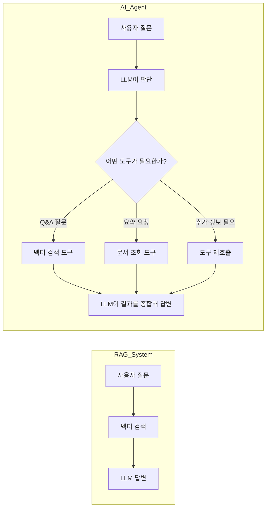

**핵심 차이**: RAG는 항상 벡터 검색을 실행합니다. 에이전트는 질문을 분석하고 어떤 도구를 몇 번 호출할지 스스로 결정합니다.

### LangGraph란?

LangGraph는 LLM 애플리케이션의 실행 흐름을 **방향 그래프(Directed Graph)**로 표현하는 프레임워크입니다.

- **노드(Node)**: 실행 단위 (LLM 호출, 도구 실행 등)
- **엣지(Edge)**: 노드 간 연결 (다음에 무엇을 실행할지)
- **상태(State)**: 그래프 전체에서 공유되는 데이터 (대화 메시지 등)

조건부 엣지를 사용하면 "도구 호출이 필요하면 tools 노드로, 아니면 종료"처럼 동적인 흐름을 만들 수 있습니다.

### ReAct 패턴이란?

ReAct는 에이전트의 사고 방식을 표현한 패턴입니다. **Re**asoning(추론)과 **Act**ing(행동)의 합성어입니다.

```
[사용자 질문]: "MongoDB 백업 모범 사례를 알려줘"

Think:  이 질문은 구체적인 정보가 필요한 Q&A 유형이다.
        벡터 검색 도구를 사용해야 한다.

Act:    get_information_for_question_answering("MongoDB backup best practices") 호출

Observe: 검색 결과: "mongodump를 사용하여..."

Think:  검색된 문서로 충분히 답변 가능하다. 도구를 다시 부를 필요가 없다.

Answer: "MongoDB 백업 모범 사례는 다음과 같습니다..."
```

이 순환(Think → Act → Observe → Think → ...)이 종료 조건에 도달할 때까지 반복됩니다.

---

## 전체 워크플로우

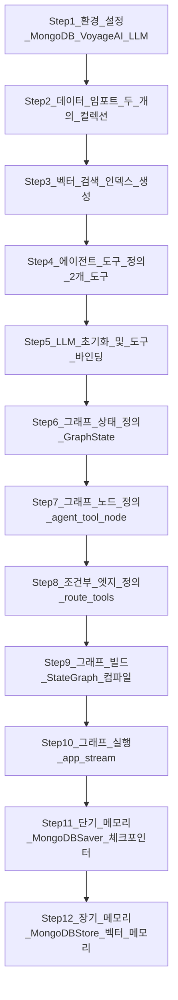

---

## Step 1: 환경 설정

### 무엇을 하는가

MongoDB Atlas에 연결하고, 이 실습에서 사용할 세 가지 서비스의 API 키를 설정합니다.

### 왜 하는가

이 실습은 다음 세 가지 외부 서비스를 사용합니다.

- **MongoDB Atlas**: 문서, 벡터 인덱스, 대화 메모리를 저장하는 데이터베이스
- **Voyage AI**: 텍스트를 벡터로 변환하는 임베딩 모델 (쿼리 임베딩, 장기 메모리 임베딩)
- **LLM**: 에이전트의 두뇌 역할 (Claude, Gemini, GPT-4.1 중 선택)

### 어떻게 동작하는가

```python
from pymongo import MongoClient
from utils import set_env

# MongoDB Atlas 연결
MONGODB_URI = os.environ.get("MONGODB_URI")
mongodb_client = MongoClient(MONGODB_URI)
mongodb_client.admin.command("ping")
# 결과: {'ok': 1.0, ...}  ← ok: 1.0 이면 연결 성공

# LLM 프로바이더 선택
# "aws"       → Claude (Anthropic, AWS Bedrock 경유)
# "google"    → Gemini
# "microsoft" → GPT-4.1
LLM_PROVIDER = "aws"
PASSKEY = "강사에게_받은_패스키"

# API 키를 환경변수로 설정 (voyageai + 선택한 LLM 프로바이더)
set_env([LLM_PROVIDER, "voyageai"], PASSKEY)
```

> RAG 실습과 달리 LLM API 키도 함께 설정합니다. 에이전트는 LLM을 직접 호출하여 "어떤 도구를 사용할지"를 결정하기 때문입니다.

---

## Step 2: 데이터 임포트

### 무엇을 하는가

MongoDB 공식 문서 데이터를 두 개의 컬렉션에 각각 임포트합니다.

### 왜 두 개의 컬렉션이 필요한가

에이전트가 수행하는 두 가지 작업이 서로 다른 데이터 구조를 필요로 합니다.

| 컬렉션 | 용도 | 데이터 구조 |
|--------|------|------------|
| `mongodb_docs_embeddings` | Q&A (질문에 관련된 문단 검색) | 청크 단위로 분할 + 사전 계산된 임베딩 벡터 포함 |
| `mongodb_docs` | 요약 (문서 전체 내용 조회) | 페이지 단위 전체 문서, 임베딩 없음 |

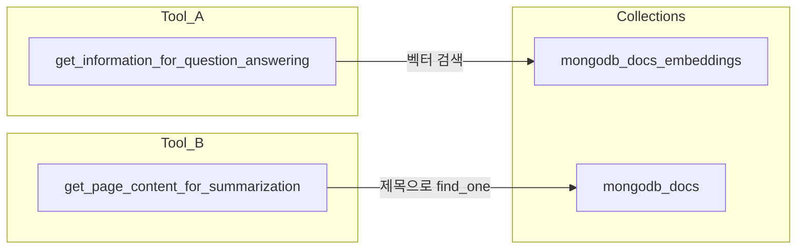

### 왜 임베딩을 직접 생성하지 않는가

RAG 실습에서는 데이터를 직접 청킹하고 임베딩을 생성했습니다. 이 실습에서는 **사전 계산된 임베딩**이 포함된 JSON 파일을 그대로 임포트합니다. 임베딩 생성에 시간이 소요되므로, 에이전트 구현에 집중하기 위해 이미 처리된 데이터를 사용합니다.

### 어떻게 동작하는가

```python
DB_NAME = "mongodb_genai_devday_agents"
VS_COLLECTION_NAME = "mongodb_docs_embeddings"   # 벡터 검색용
FULL_COLLECTION_NAME = "mongodb_docs"            # 전체 문서 조회용

vs_collection = mongodb_client[DB_NAME][VS_COLLECTION_NAME]
full_collection = mongodb_client[DB_NAME][FULL_COLLECTION_NAME]

# 벡터 검색용 컬렉션 임포트 (청크 + 임베딩)
with open(f"../data/{VS_COLLECTION_NAME}.json", "r") as f:
    data = json.loads(f.read())
vs_collection.delete_many({})
vs_collection.insert_many(data)
# 결과: N documents ingested into the mongodb_docs_embeddings collection.

# 전체 문서 컬렉션 임포트 (페이지 단위)
with open(f"../data/{FULL_COLLECTION_NAME}.json", "r") as f:
    data = json.loads(f.read())
full_collection.delete_many({})
full_collection.insert_many(data)
# 결과: N documents ingested into the mongodb_docs collection.
```

---

## Step 3: 벡터 검색 인덱스 생성

### 무엇을 하는가

`mongodb_docs_embeddings` 컬렉션의 `embedding` 필드에 벡터 검색 인덱스를 생성합니다.

### 왜 하는가

에이전트의 Q&A 도구는 사용자 질문을 벡터로 변환한 후 유사한 문서를 검색합니다. 이 `$vectorSearch` 쿼리를 실행하려면 Atlas에 벡터 인덱스가 미리 생성되어 있어야 합니다.

### 어떻게 동작하는가

```python
model = {
    "name": "vector_index",
    "type": "vectorSearch",
    "definition": {
        "fields": [
            {
                "type": "vector",
                "path": "embedding",       # 임베딩이 저장된 필드
                "numDimensions": 1024,     # voyage-context-3 모델의 벡터 차원 수
                "similarity": "cosine",    # 코사인 유사도로 비교
            }
        ]
    },
}

create_index(vs_collection, "vector_index", model)
check_index_ready(vs_collection, "vector_index")
# 결과:
# vector_index index status: PENDING
# vector_index index status: READY   ← READY가 될 때까지 대기
```

**`numDimensions: 1024`**: Voyage AI의 `voyage-context-3` 모델이 생성하는 벡터의 차원 수입니다. 임베딩 모델마다 다르며, 데이터를 생성한 모델과 반드시 일치해야 합니다.

---

## Step 4: 에이전트 도구 정의

### 무엇을 하는가

에이전트가 사용할 두 가지 도구(Tool)를 LangChain의 `@tool` 데코레이터로 정의합니다.

### 왜 하는가

에이전트는 LLM 단독으로는 할 수 없는 작업을 도구를 통해 수행합니다. MongoDB에서 정보를 검색하는 것이 그 예입니다. `@tool` 데코레이터를 붙이면 LangChain이 함수의 이름과 docstring을 LLM이 이해할 수 있는 형식으로 변환합니다. LLM은 이 정보를 보고 "언제 어떤 도구를 써야 하는지"를 결정합니다.

### 도구 1: 질문 답변용 벡터 검색

```python
from langchain.agents import tool
import voyageai

vo = voyageai.Client()

def get_embeddings(query: str) -> List[float]:
    # Voyage AI의 컨텍스트 임베딩으로 쿼리를 벡터로 변환
    embds_obj = vo.contextualized_embed(
        inputs=[[query]],
        model="voyage-context-3",
        input_type="query"   # 검색용은 반드시 "query"
    )
    return embds_obj.results[0].embeddings[0]

@tool
def get_information_for_question_answering(user_query: str) -> str:
    """
    Retrieve information using vector search to answer a user query.
    """
    query_embedding = get_embeddings(user_query)

    pipeline = [
        {
            "$vectorSearch": {
                "index": VS_INDEX_NAME,
                "path": "embedding",
                "queryVector": query_embedding,
                "numCandidates": 150,   # 후보 150개 중
                "limit": 5,            # 상위 5개 반환
            }
        },
        {
            "$project": {
                "_id": 0,
                "body": 1,
                "score": {"$meta": "vectorSearchScore"},
            }
        },
    ]

    results = vs_collection.aggregate(pipeline)
    return "\n\n".join([doc.get("body") for doc in results])
```

### 도구 2: 요약용 전체 문서 조회

```python
@tool
def get_page_content_for_summarization(user_query: str) -> str:
    """
    Retrieve page content based on provided title.
    """
    query = {"title": user_query}          # 제목으로 정확히 일치하는 문서 찾기
    projection = {"_id": 0, "body": 1}    # body 필드만 반환

    document = full_collection.find_one(query, projection)
    if document:
        return document["body"]
    else:
        return "Document not found"
```

### 두 도구의 차이점

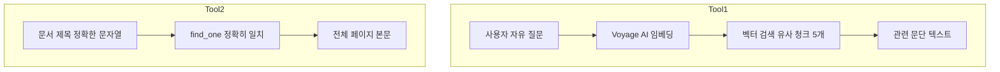

| 도구 | 입력 | 검색 방식 | 적합한 질문 유형 |
|------|------|----------|----------------|
| `get_information_for_question_answering` | 자유로운 질문 문장 | 벡터 유사도 검색 | "MongoDB 백업 방법은?" |
| `get_page_content_for_summarization` | 문서 페이지 제목 | 제목 정확 일치 | "Create a MongoDB Deployment 페이지를 요약해줘" |

LLM은 두 도구의 docstring을 읽고, 사용자 질문의 유형에 따라 적합한 도구를 선택합니다.

---

## Step 5: LLM 초기화

### 무엇을 하는가

LLM 객체를 생성하고, 프롬프트 템플릿과 도구를 연결하여 `llm_with_tools` 체인을 만듭니다.

### 왜 하는가

LLM이 도구를 "사용"하려면 두 가지가 필요합니다.

1. **`bind_tools`**: LLM에게 "이런 도구들이 있다"고 알려줍니다. LLM은 응답에 일반 텍스트 대신 "이 도구를 이 인자로 호출하라"는 구조화된 tool_call을 포함시킬 수 있게 됩니다.
2. **프롬프트 템플릿**: Chain-of-Thought(단계적 사고) 방식으로 LLM이 문제를 접근하도록 안내합니다.

### 어떻게 동작하는가

```python
from langchain_core.prompts import ChatPromptTemplate, MessagesPlaceholder
from utils import get_llm

llm = get_llm(LLM_PROVIDER)   # Claude / Gemini / GPT-4.1 중 하나

# Chain-of-Thought 프롬프트 정의
prompt = ChatPromptTemplate.from_messages([
    (
        "You are a helpful AI assistant."
        " Think step-by-step and use these tools to get the information required."
        " Do not re-run tools unless absolutely necessary."
        " If you are not able to get enough information using the tools, reply with I DON'T KNOW."
        " You have access to the following tools: {tool_names}."
    ),
    MessagesPlaceholder(variable_name="messages"),  # 대화 메시지가 여기에 삽입됨
])

# 프롬프트에 도구 이름 주입
prompt = prompt.partial(tool_names=", ".join([tool.name for tool in tools]))

# LLM에 도구 목록 바인딩
bind_tools = llm.bind_tools(tools)

# 프롬프트 → LLM(with tools) 체인 구성
llm_with_tools = prompt | bind_tools
```

**`prompt | bind_tools`**: LangChain의 파이프 연산자입니다. 입력이 `prompt`를 통과하여 포맷된 후, `bind_tools`(도구가 연결된 LLM)로 전달됩니다.

```python
# 도구 선택이 제대로 되는지 확인
llm_with_tools.invoke(
    ["Give me a summary of the page titled Create a MongoDB Deployment."]
).tool_calls
# 결과: [{'name': 'get_page_content_for_summarization', 'args': {'user_query': 'Create a MongoDB Deployment'}, ...}]

llm_with_tools.invoke(
    ["What are some best practices for data backups in MongoDB?"]
).tool_calls
# 결과: [{'name': 'get_information_for_question_answering', 'args': {'user_query': '...'}, ...}]
```

LLM이 질문 유형에 따라 올바른 도구를 선택하는 것을 확인할 수 있습니다.

---

## Step 6: 그래프 상태 정의

### 무엇을 하는가

LangGraph 그래프 전체에서 공유될 상태(State) 구조를 정의합니다.

### 왜 하는가

LangGraph의 노드들은 서로 직접 데이터를 주고받지 않습니다. 모든 노드는 공유 상태를 읽고 씁니다. 상태가 무엇을 담을지 미리 TypedDict로 선언해야 합니다.

### 어떻게 동작하는가

```python
from typing import Annotated
from langgraph.graph.message import add_messages
from typing_extensions import TypedDict

class GraphState(TypedDict):
    messages: Annotated[list, add_messages]
```

단 두 줄이지만 중요한 내용이 담겨 있습니다.

- **`messages: list`**: 그래프 상태가 대화 메시지 목록을 담습니다.
- **`Annotated[list, add_messages]`**: 노드가 `messages`를 업데이트할 때 기존 목록을 덮어쓰지 않고 **누적**합니다. `add_messages`가 자동으로 메시지를 병합합니다.

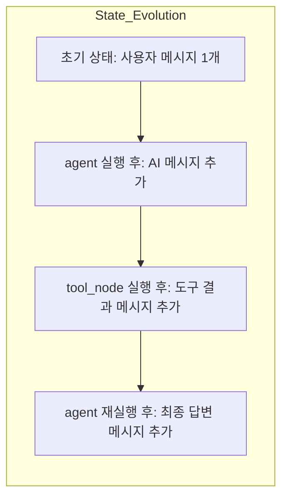

상태에 더 많은 필드를 추가할 수도 있습니다. 예를 들어 `user_id: str`을 추가하면 모든 노드에서 사용자 정보에 접근할 수 있습니다.

---

## Step 7: 그래프 노드 정의

### 무엇을 하는가

그래프의 두 핵심 노드인 `agent` 노드와 `tool_node` 노드를 Python 함수로 정의합니다.

### 왜 하는가

LangGraph에서 노드는 상태를 입력으로 받고, 상태에 대한 업데이트를 반환하는 함수입니다. 두 노드의 역할은 명확히 구분됩니다.

- **`agent` 노드**: LLM을 호출합니다. "도구를 호출할지", "바로 답변할지"를 결정합니다.
- **`tool_node` 노드**: LLM이 요청한 도구를 실제로 실행하고 결과를 상태에 추가합니다.

### agent 노드

```python
from langchain_core.messages import ToolMessage

def agent(state: GraphState) -> Dict[str, List]:
    messages = state["messages"]           # 현재까지의 모든 대화 메시지
    result = llm_with_tools.invoke(messages)  # LLM 호출
    return {"messages": [result]}
    # result가 tool_call을 포함하면 → tool_node로
    # result가 일반 텍스트 답변이면 → 종료
```

### tool_node 노드

```python
tools_by_name = {tool.name: tool for tool in tools}
# 예: {"get_information_for_question_answering": <함수>, "get_page_content_for_summarization": <함수>}

def tool_node(state: GraphState) -> Dict[str, List]:
    result = []
    # 마지막 AI 메시지에서 도구 호출 목록 추출
    tool_calls = state["messages"][-1].tool_calls
    # tool_call 구조 예시:
    # {
    #   "name": "get_information_for_question_answering",
    #   "args": {"user_query": "MongoDB backup"},
    #   "id": "call_abc123",
    #   "type": "tool_call"
    # }
    for tool_call in tool_calls:
        tool = tools_by_name[tool_call["name"]]          # 이름으로 함수 찾기
        observation = tool.invoke(tool_call["args"])     # 도구 실행
        result.append(ToolMessage(
            content=observation,
            tool_call_id=tool_call["id"]  # 어떤 tool_call에 대한 결과인지 연결
        ))
    return {"messages": result}
```

**`ToolMessage`**: LangChain에서 도구 실행 결과를 나타내는 특별한 메시지 타입입니다. `tool_call_id`로 어느 tool_call에 대한 응답인지 연결되어, LLM이 "내가 요청한 도구의 결과"로 인식합니다.

---

## Step 8: 조건부 엣지 정의

### 무엇을 하는가

`agent` 노드의 출력을 보고 다음 목적지를 결정하는 라우팅 함수를 정의합니다.

### 왜 하는가

에이전트는 매 LLM 호출마다 두 가지 중 하나를 결정합니다.

1. 도구가 더 필요하다 → `tool_node`로 이동
2. 충분한 정보를 얻었다 → 그래프 종료(END)

이 판단 로직을 `route_tools` 함수로 구현합니다.

### 어떻게 동작하는가

```python
from langgraph.graph import END

def route_tools(state: GraphState):
    messages = state.get("messages", [])
    if not messages:
        raise ValueError("No messages in state")

    ai_message = messages[-1]  # 마지막 메시지 (항상 AI 응답)

    # tool_calls 속성이 있고 비어있지 않으면 → 도구 호출 필요
    if hasattr(ai_message, "tool_calls") and len(ai_message.tool_calls) > 0:
        return "tools"

    # tool_calls가 없으면 → 최종 답변 완료, 그래프 종료
    return END
```

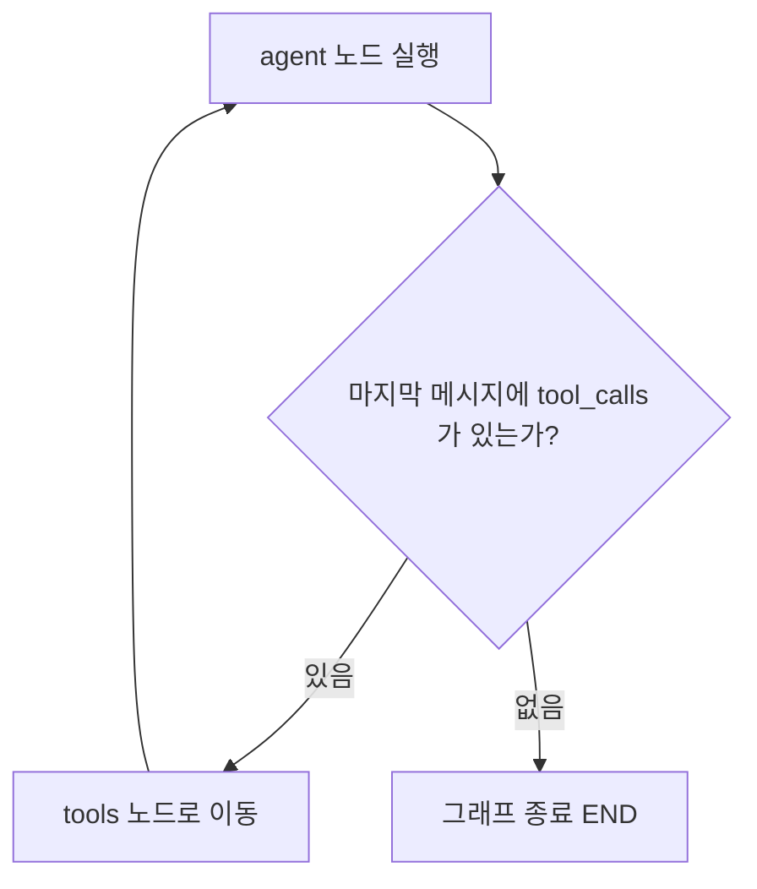

---

## Step 9: 그래프 빌드

### 무엇을 하는가

앞서 정의한 노드와 엣지를 조합하여 완성된 LangGraph 그래프를 만들고 컴파일합니다.

### 왜 하는가

LangGraph에서 `StateGraph`는 설계도입니다. 노드(무엇을 실행할지)와 엣지(어떤 순서로 실행할지)를 등록한 후 `compile()`을 호출하면 실행 가능한 앱이 됩니다.

### 어떻게 동작하는가

```python
from langgraph.graph import StateGraph, START

# 1. 그래프 생성 (GraphState 구조 사용)
graph = StateGraph(GraphState)

# 2. 노드 등록
graph.add_node("agent", agent)       # "agent" 이름으로 agent 함수 등록
graph.add_node("tools", tool_node)   # "tools" 이름으로 tool_node 함수 등록

# 3. 고정 엣지 등록 (항상 이 방향으로 이동)
graph.add_edge(START, "agent")   # 시작 → agent
graph.add_edge("tools", "agent") # tools 실행 후 → 다시 agent (ReAct 루프)

# 4. 조건부 엣지 등록 (route_tools 함수의 반환값에 따라 분기)
graph.add_conditional_edges(
    "agent",       # 출발 노드
    route_tools,   # 라우팅 함수
    {"tools": "tools", END: END}  # 반환값 → 목적지 매핑
)

# 5. 컴파일
app = graph.compile()
```

### 최종 그래프 구조

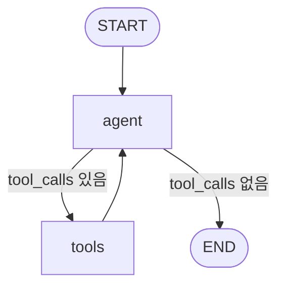

이 구조가 ReAct 패턴을 구현합니다. `agent → tools → agent → tools → ... → agent → END` 순으로 반복하다가 LLM이 충분한 정보를 얻었다고 판단하면 종료합니다.

---

## Step 10: 그래프 실행

### 무엇을 하는가

완성된 그래프에 사용자 입력을 넣고, 각 단계의 실행 결과를 스트리밍으로 출력합니다.

### 왜 하는가

`app.stream()`을 사용하면 최종 답변이 나올 때까지 기다리지 않고 각 노드 실행 후의 상태 변화를 실시간으로 볼 수 있습니다. 에이전트가 어떤 도구를 몇 번 호출하는지, 어떻게 결론에 도달하는지 추적할 수 있습니다.

### 어떻게 동작하는가

```python
def execute_graph(user_input: str) -> None:
    for step in app.stream(
        {"messages": [{"role": "user", "content": user_input}]},
        stream_mode="values",  # 각 단계 후 전체 상태(state)를 반환
    ):
        step["messages"][-1].pretty_print()  # 최신 메시지만 출력
```

**에이전트 실행 흐름 예시** (Q&A 질문):

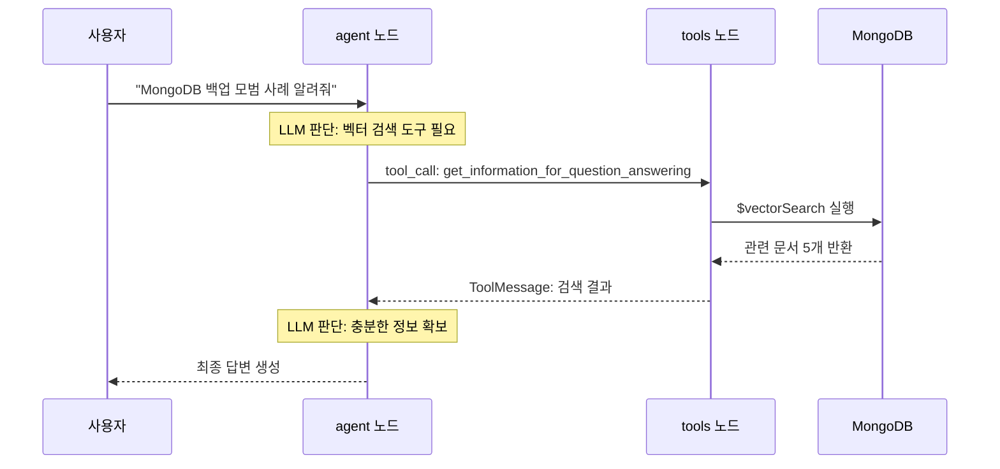

**에이전트 실행 흐름 예시** (요약 요청):

```python
execute_graph("Give me a summary of the page titled Create a MongoDB Deployment")
# Step 1 (agent): LLM이 get_page_content_for_summarization 도구 호출 결정
# Step 2 (tools): full_collection에서 해당 페이지 find_one으로 조회
# Step 3 (agent): LLM이 전체 본문을 요약하여 최종 답변 생성
```

---

## Step 11: 단기 메모리 추가

### 무엇을 하는가

`MongoDBSaver`를 체크포인터로 사용하여 대화 상태를 MongoDB에 자동 저장합니다. `thread_id`로 대화 세션을 구분하여 이전 대화를 기억합니다.

### 왜 하는가

Step 10까지의 에이전트는 매 호출이 독립적입니다. "방금 뭐 물어봤어?"라고 하면 모른다고 합니다. 단기 메모리(체크포인터)를 추가하면 같은 `thread_id` 내에서 이전 대화를 기억합니다.

**`thread_id`의 역할:**

```
thread_id = "1"  →  사용자 A의 대화 세션
thread_id = "2"  →  사용자 B의 대화 세션 (또는 새 세션)

같은 thread_id로 여러 번 호출 → 이전 대화를 기억함
다른 thread_id로 호출 → 새 대화 시작
```

### 어떻게 동작하는가

```python
from langgraph.checkpoint.mongodb import MongoDBSaver

# MongoDB에 체크포인트를 저장하는 객체
checkpointer = MongoDBSaver(mongodb_client)

# 체크포인터를 포함하여 그래프 재컴파일
app = graph.compile(checkpointer=checkpointer)
```

```python
def execute_graph(thread_id: str, user_input: str) -> None:
    # thread_id를 포함한 설정 딕셔너리
    config = {"configurable": {"thread_id": thread_id}}

    for step in app.stream(
        {"messages": [{"role": "user", "content": user_input}]},
        config,           # 설정 전달 (thread_id 포함)
        stream_mode="values",
    ):
        step["messages"][-1].pretty_print()
```

**테스트:**

```python
# 첫 번째 질문
execute_graph("1", "What are some best practices for data backups in MongoDB?")
# 에이전트: 벡터 검색 후 백업 관련 답변 생성

# 후속 질문 (같은 thread_id "1" 사용)
execute_graph("1", "What did I just ask you?")
# 에이전트: "You asked about best practices for data backups in MongoDB."
# ← 이전 대화를 기억함
```

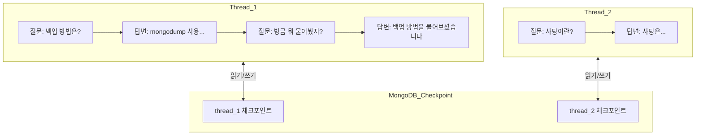

**체크포인터가 저장하는 것**: 단순히 메시지 목록만 저장하는 것이 아닙니다. 그래프가 어느 노드까지 실행됐는지, 각 단계에서의 전체 상태를 스냅샷으로 저장합니다. 서버가 재시작되어도 이전 대화를 이어갈 수 있습니다.

---

## Step 12: 장기 메모리 추가 (보너스)

### 무엇을 하는가

`MongoDBStore`와 Voyage AI 임베딩을 결합하여, 세션이 달라져도 유지되는 장기 메모리를 구현합니다. 사용자 선호도나 중요 정보를 저장하고, 벡터 검색으로 관련 메모리를 불러옵니다.

### 단기 메모리 vs 장기 메모리

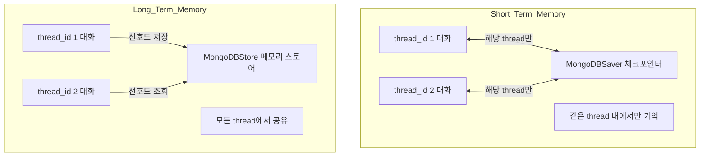

| 구분 | 저장소 | 범위 | 내용 |
|------|--------|------|------|
| 단기 메모리 | MongoDBSaver (checkpointer) | thread 내부 | 대화 메시지 전체 |
| 장기 메모리 | MongoDBStore (store) | 모든 thread 공유 | 사용자 선호도, 중요 사실 |

### 어떻게 동작하는가

**1단계: MongoDBStore 초기화**

```python
from langgraph.store.mongodb import MongoDBStore, create_vector_index_config
from langchain_voyageai import VoyageAIEmbeddings

memory_collection = mongodb_client[DB_NAME]["memories"]

# 벡터 검색으로 관련 메모리를 찾을 수 있도록 임베딩 설정
mongodb_store = MongoDBStore(
    collection=memory_collection,
    index_config=create_vector_index_config(
        embed=VoyageAIEmbeddings(model="voyage-4-large"),
        dims=1024,
    )
)
```

**2단계: 메모리 저장 도구 추가**

```python
import uuid

@tool
def save_memory(memory: str) -> str:
    """
    Save important facts and preferences about the user for future conversations.
    """
    mongodb_store.put(
        ("user_1",),              # 네임스페이스 (사용자별로 구분)
        key=str(uuid.uuid4()),    # 고유 메모리 ID
        value={"text": memory}   # 저장할 내용
    )
    return f"Memory saved: {memory}"

# 도구 목록에 save_memory 추가
tools = [
    get_information_for_question_answering,
    get_page_content_for_summarization,
    save_memory,  # 새로 추가
]
```

**3단계: agent 노드에서 장기 메모리 조회**

```python
def agent(state: GraphState) -> Dict[str, List]:
    messages = state["messages"]

    # 사용자의 마지막 메시지로 관련 메모리를 벡터 검색
    memories = mongodb_store.search(
        ("user_1",),
        query=messages[-1].content,
        limit=10
    )
    memories_text = "\n".join(m.value["text"] for m in memories)
    memories_text = memories_text if memories_text else "No memories stored yet."

    # 메모리를 시스템 프롬프트에 포함
    system_prompt = (
        "You are a helpful AI assistant. ..."
        "If the user shares any preferences, save them using the save_memory tool."
        f"Past user memories:\n{memories_text}"
    )

    result = bind_tools.invoke([
        {"role": "system", "content": system_prompt},
        *messages,
    ])
    return {"messages": [result]}
```

**4단계: 체크포인터와 스토어를 함께 컴파일**

```python
app = graph.compile(
    checkpointer=checkpointer,  # 단기 메모리
    store=mongodb_store         # 장기 메모리
)
```

### 장기 메모리 동작 흐름

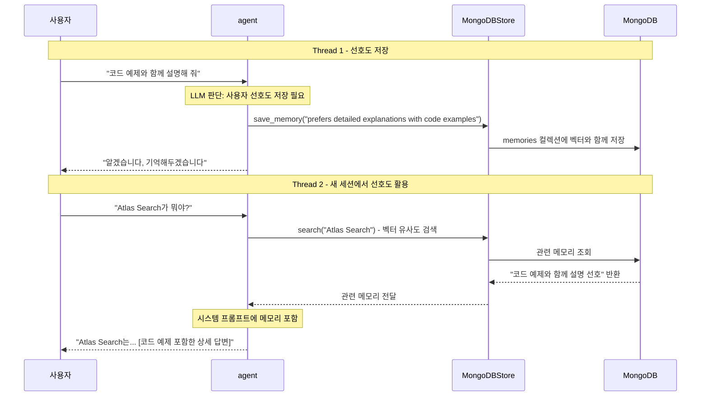

**테스트:**

```python
# Thread 1: 선호도 저장
execute_graph("1", "Remember that I prefer detailed explanations with code examples.")
# 에이전트가 save_memory 도구를 호출하여 MongoDB에 저장

# Thread 2: 완전히 새 세션에서 장기 메모리 활용
execute_graph("2", "Hi! Do you remember anything about how I like to learn?")
# 에이전트: Thread 1에서 저장된 선호도를 벡터 검색으로 찾아 답변
# "Yes! You prefer detailed explanations with code examples."
```

---

## 전체 요약 및 다음 단계

### 이 실습에서 구현한 것

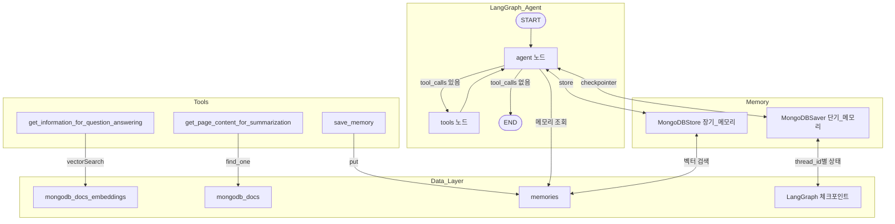

### 핵심 개념 정리

| 개념 | 역할 | 이 실습에서 사용한 도구 |
|------|------|----------------------|
| `@tool` 데코레이터 | Python 함수를 LLM이 호출 가능한 도구로 변환 | LangChain `langchain.agents.tool` |
| `bind_tools` | LLM에 도구 목록을 등록하여 tool_call 생성 활성화 | `llm.bind_tools(tools)` |
| `GraphState` | 그래프 노드 간 공유되는 상태 구조 | LangGraph TypedDict + add_messages |
| `agent` 노드 | LLM 호출 및 도구 호출 결정 | `llm_with_tools.invoke(messages)` |
| `tool_node` 노드 | LLM이 요청한 도구를 실제 실행 | `tool.invoke(tool_call["args"])` |
| 조건부 엣지 | tool_calls 유무에 따라 실행 흐름 분기 | `add_conditional_edges` + `route_tools` |
| ReAct 패턴 | Think-Act-Observe 반복으로 문제 해결 | `tools → agent` 순환 구조 |
| 단기 메모리 | thread 내 대화 상태를 MongoDB에 체크포인트 저장 | `MongoDBSaver(checkpointer)` |
| 장기 메모리 | thread 간 사용자 정보를 벡터 검색으로 저장/조회 | `MongoDBStore` + VoyageAI 임베딩 |

### AI 에이전트 전체 아키텍처

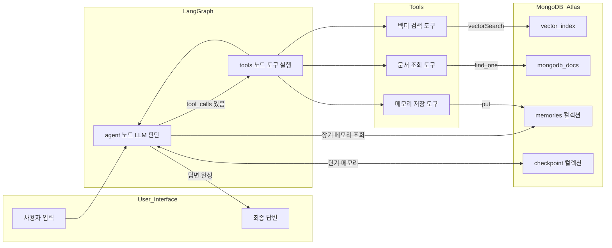

### 다음 단계

이 실습을 마쳤다면 다음을 시도해보세요.

1. **도구 추가하기**: 웹 검색, 계산기, 날씨 API 등 새로운 도구를 `@tool`로 만들어 에이전트에 추가해보세요.
2. **다중 에이전트 시스템**: LangGraph의 `Send` API를 사용하여 여러 전문 에이전트가 협력하는 시스템을 구축해보세요.
3. **사용자별 네임스페이스 분리**: 현재는 `("user_1",)` 고정이지만, 실제 서비스에서는 사용자 ID를 동적으로 사용하도록 수정해보세요.
4. **Human-in-the-loop**: `interrupt_before=["tools"]`로 도구 실행 전 사람의 승인을 받는 흐름을 구현해보세요.
5. **에이전트 평가**: LangSmith를 연동하여 에이전트의 도구 선택 정확도와 답변 품질을 평가해보세요.

### 참고 자료

- [LangGraph 공식 문서](https://langchain-ai.github.io/langgraph/)
- [LangGraph Persistence (체크포인터)](https://langchain-ai.github.io/langgraph/concepts/persistence/)
- [LangGraph Memory Store](https://langchain-ai.github.io/langgraph/concepts/memory/)
- [MongoDB Atlas Vector Search](https://www.mongodb.com/docs/atlas/atlas-vector-search/)
- [Voyage AI Contextual Embeddings](https://docs.voyageai.com/docs/contextualized-chunk-embeddings)
- [ReAct 논문 (Yao et al., 2022)](https://arxiv.org/abs/2210.03629)
