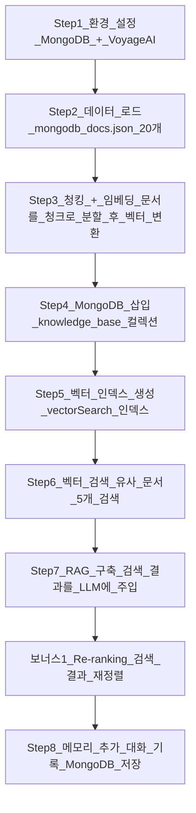
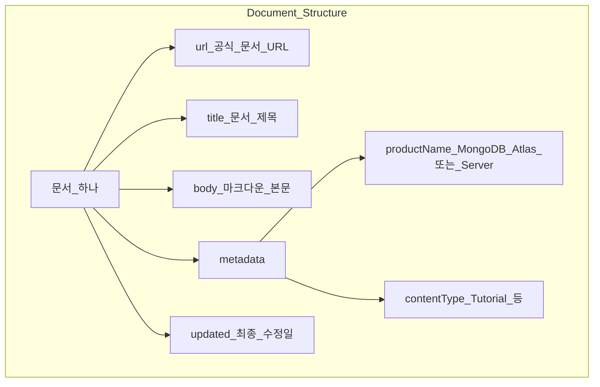
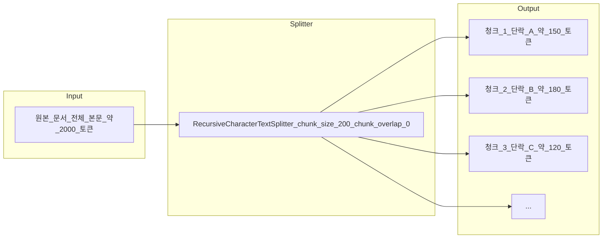
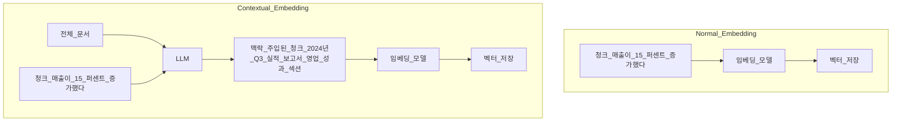
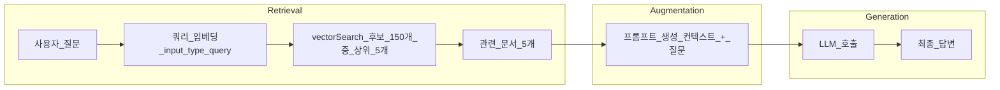
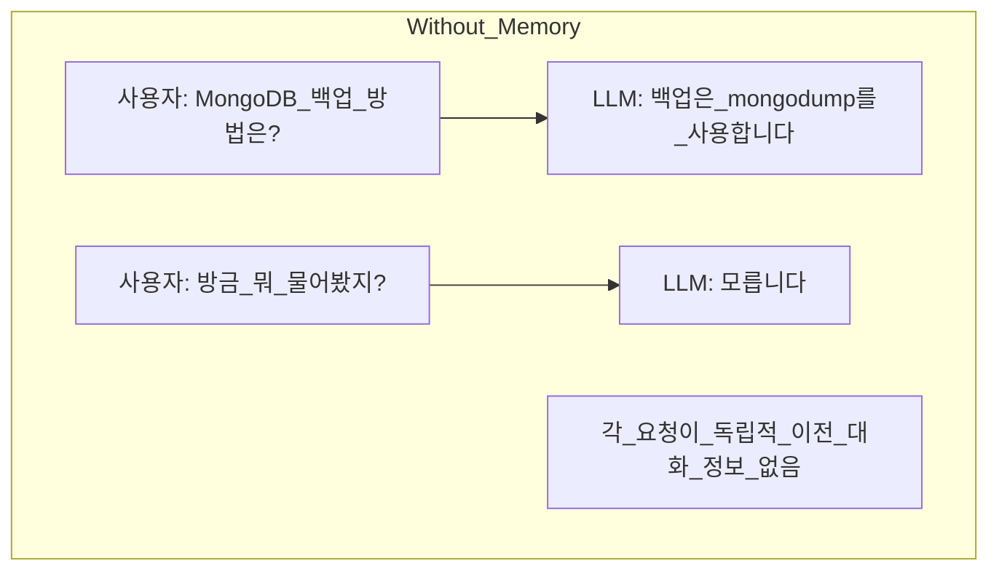
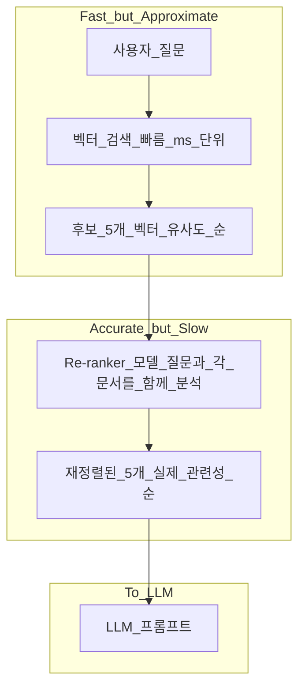
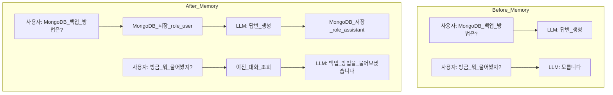
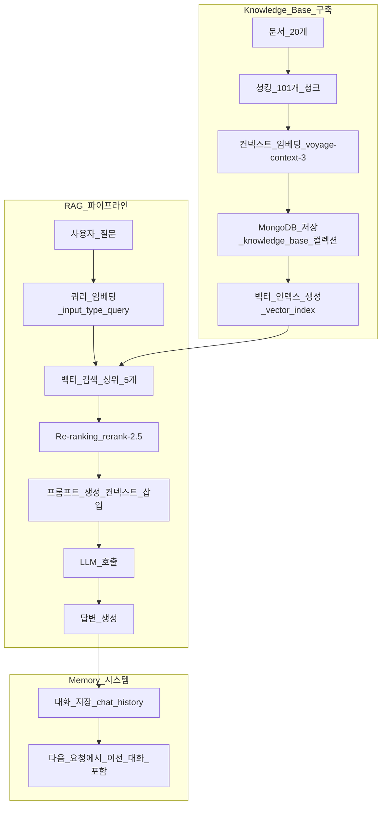

# MongoDB로 구현하는 RAG 애플리케이션 완전 입문 가이드

> **대상 독자**: RAG와 LLM을 처음 접하는 개발자
> **소요 시간**: 약 90분
> **난이도**: 초급 ~ 중급

---

## 목차

1. [이 가이드에서 배울 것](#이-가이드에서-배울-것)
2. [핵심 개념 먼저 이해하기](#핵심-개념-먼저-이해하기)
3. [전체 워크플로우](#전체-워크플로우)
4. [Step 1: 환경 설정](#step-1-환경-설정)
5. [Step 2: 데이터 로드](#step-2-데이터-로드)
6. [Step 3: 청킹과 임베딩](#step-3-청킹과-임베딩)
7. [Step 4: MongoDB에 데이터 삽입](#step-4-mongodb에-데이터-삽입)
8. [Step 5: 벡터 검색 인덱스 생성](#step-5-벡터-검색-인덱스-생성)
9. [Step 6: 벡터 검색 실행](#step-6-벡터-검색-실행)
10. [Step 7: RAG 애플리케이션 구축](#step-7-rag-애플리케이션-구축)
11. [보너스 1: Re-ranking으로 검색 정확도 향상](#보너스-1-re-ranking으로-검색-정확도-향상)
12. [Step 8: 메모리 추가](#step-8-메모리-추가)
13. [전체 요약 및 다음 단계](#전체-요약-및-다음-단계)

---

## 이 가이드에서 배울 것

이 가이드를 마치면 다음을 할 수 있습니다.

- LangChain으로 긴 문서를 검색 가능한 청크로 분할하기
- Voyage AI의 컨텍스트 임베딩으로 검색 정확도를 높이기
- MongoDB Atlas에 벡터 데이터를 저장하고 인덱스 생성하기
- `$vectorSearch` 파이프라인으로 의미 기반 문서 검색하기
- 검색 결과를 LLM 프롬프트에 주입하여 RAG 애플리케이션 만들기
- Re-ranking으로 검색 품질을 추가로 향상하기
- MongoDB에 대화 기록을 저장하여 LLM에 메모리 부여하기

**최종 결과물**: MongoDB 공식 문서 20개를 지식 기반으로 삼아, 질문을 입력하면 관련 문서를 검색하고 LLM이 답변을 생성하는 RAG 챗봇

---

## 핵심 개념 먼저 이해하기

### LLM(Large Language Model)이란?

LLM은 대규모 텍스트로 학습된 언어 모델입니다. GPT-4, Claude, Gemini 같은 모델이 이에 해당합니다. 질문을 주면 자연스러운 문장으로 답변을 생성합니다.

**LLM의 한계:**
- 학습 시점 이후의 정보를 모릅니다 (지식 차단 날짜)
- 사내 문서, 특정 제품 문서 같은 비공개 정보를 모릅니다
- 없는 내용을 있는 것처럼 답변하는 "환각(Hallucination)" 현상이 있습니다

### RAG(Retrieval-Augmented Generation)란?

RAG는 LLM의 한계를 극복하는 방법입니다. 질문에 답하기 전에 관련 문서를 먼저 검색하고, 그 내용을 LLM에게 제공하여 답변 품질을 높입니다.

이름을 풀어보면:
- **Retrieval**: 관련 문서를 검색한다
- **Augmented**: 검색 결과로 프롬프트를 보강한다
- **Generation**: LLM이 답변을 생성한다

```
[RAG 없이]
사용자: "MongoDB 샤드 클러스터 백업 방법은?"
LLM: "잘 모르겠습니다" 또는 잘못된 정보 생성

[RAG 적용 후]
사용자: "MongoDB 샤드 클러스터 백업 방법은?"
시스템: MongoDB 문서에서 관련 내용 검색 → LLM 프롬프트에 포함
LLM: 검색된 문서를 바탕으로 정확한 답변 생성
```

### 임베딩(Embedding)이란?

임베딩은 텍스트를 숫자 배열(벡터)로 변환한 것입니다. 의미가 비슷한 텍스트는 비슷한 숫자 배열을 갖습니다.

```
"MongoDB 백업 방법"    → [0.82, 0.15, -0.33, ...]
"데이터베이스 복원"    → [0.79, 0.18, -0.31, ...]  ← 의미가 비슷하므로 벡터도 비슷
"파이썬 웹 프레임워크" → [-0.21, 0.94, 0.11, ...]  ← 의미가 달라서 벡터도 다름
```

이 숫자 배열 간의 거리를 계산하면 "어떤 문서가 질문과 가장 관련 있는가"를 찾을 수 있습니다. 이것이 벡터 검색의 핵심입니다.

---

## 전체 워크플로우



---

## Step 1: 환경 설정

### 무엇을 하는가

MongoDB Atlas 클러스터에 연결하고, Voyage AI API 키를 설정합니다.

### 왜 하는가

이 실습은 두 가지 외부 서비스를 사용합니다.

- **MongoDB Atlas**: 문서와 벡터 인덱스를 저장하는 데이터베이스
- **Voyage AI**: 텍스트를 벡터로 변환하는 임베딩 모델 서비스

두 서비스 모두 연결이 확인되어야 이후 단계를 진행할 수 있습니다.

### 어떻게 동작하는가

```python
from pymongo import MongoClient
from utils import set_env

# MongoDB Atlas 연결
MONGODB_URI = os.environ.get("MONGODB_URI")
mongodb_client = MongoClient(MONGODB_URI)

# 연결 확인 (ping 명령)
mongodb_client.admin.command("ping")
# 결과: {'ok': 1.0, ...}  ← ok: 1.0 이면 연결 성공

# Voyage AI API 키 설정
PASSKEY = "강사에게_받은_패스키"
set_env(["voyageai"], PASSKEY)
# 결과: Successfully set VOYAGE_API_KEY environment variable.
```

`ping` 명령의 응답에 `'ok': 1.0`이 있으면 MongoDB 연결에 성공한 것입니다.

---

## Step 2: 데이터 로드

### 무엇을 하는가

`mongodb_docs.json` 파일에서 MongoDB 공식 문서 20개를 불러옵니다.

### 왜 하는가

RAG 시스템의 "지식 기반"이 될 문서들입니다. LLM은 이 문서들을 참고하여 답변을 생성합니다. 실제 서비스에서는 사내 문서, 제품 매뉴얼, FAQ 등이 이 역할을 합니다.

### 어떻게 동작하는가

```python
import json

with open("../data/mongodb_docs.json", "r") as data_file:
    json_data = data_file.read()

docs = json.loads(json_data)
len(docs)  # 결과: 20
```

각 문서의 구조는 다음과 같습니다.

```python
docs[0]
# {
#   'url': 'https://mongodb.com/docs/atlas/access-tracking/',
#   'title': 'View Database Access History',
#   'body': '# View Database Access History\n\n...',  ← 마크다운 본문
#   'metadata': {
#     'productName': 'MongoDB Atlas',
#     'contentType': None,
#     'tags': ['atlas', 'docs'],
#     'version': None
#   },
#   'updated': '2024-05-20T17:30:49.148Z'
# }
```

### 문서 구조 다이어그램



---

## Step 3: 청킹과 임베딩

### 무엇을 하는가

각 문서의 본문(`body`)을 작은 조각(청크)으로 나누고, 각 청크를 벡터(숫자 배열)로 변환합니다.

### 왜 청킹이 필요한가

LLM과 임베딩 모델은 한 번에 처리할 수 있는 텍스트 길이에 제한이 있습니다. 또한 문서 전체를 하나의 벡터로 만들면 의미가 희석됩니다. 작은 단위일수록 검색 정확도가 높아집니다.

예를 들어 "MongoDB 백업 방법"을 검색할 때, 백업과 복원, 설정 등 여러 주제가 섞인 긴 문서보다 백업만 설명하는 짧은 청크가 더 정확히 매칭됩니다.

### 청킹 과정 다이어그램



### 왜 chunk_overlap을 0으로 설정하는가

일반적인 청킹에서는 청크 경계에서 문맥이 끊기는 것을 방지하기 위해 이전 청크와 일정 부분 겹치도록 설정합니다(보통 청크 크기의 15~20%). 그러나 이 실습은 **컨텍스트 임베딩**을 사용하기 때문에 오버랩이 필요하지 않습니다.

### 컨텍스트 임베딩이란?

컨텍스트 임베딩은 Anthropic이 2024년에 발표한 방식입니다. 청크를 임베딩하기 전에 LLM이 전체 문서의 맥락을 요약하여 각 청크에 주입합니다.



**왜 더 나은가:**
- 청크 자체가 "어느 문서의 어느 부분"인지 정보를 담고 있어 검색 정확도가 높아집니다
- Anthropic 실험 결과: retrieval 실패율 **49% 감소**

**trade-off:** 청크 하나당 LLM 호출이 1번씩 필요하므로 비용과 시간이 더 소요됩니다. 오버랩 없이도 맥락이 보존되므로 `chunk_overlap=0`으로 설정합니다.

### 어떻게 동작하는가

**청킹 함수:**

```python
from langchain.text_splitter import RecursiveCharacterTextSplitter

separators = ["\n\n", "\n", " ", "", "#", "##", "###"]

text_splitter = RecursiveCharacterTextSplitter.from_tiktoken_encoder(
    model_name="gpt-4",     # GPT-4 토크나이저로 토큰 수를 계산
    separators=separators,  # 이 순서대로 분할 시도
    chunk_size=200,         # 청크 최대 200 토큰
    chunk_overlap=0         # 컨텍스트 임베딩 사용시 오버랩 불필요
)

def get_chunks(doc, text_field):
    text = doc[text_field]
    chunks = text_splitter.split_text(text)
    return chunks
```

**컨텍스트 임베딩 함수:**

```python
import voyageai

vo = voyageai.Client()

def get_embeddings(content, input_type):
    # input_type: "document" (저장용) 또는 "query" (검색용)
    embds_obj = vo.contextualized_embed(
        inputs=[content],         # 청크 목록을 리스트로 감싸서 전달
        model="voyage-context-3",
        input_type=input_type
    )
    if input_type == "document":
        # 문서 임베딩: 각 청크마다 하나의 벡터
        embeddings = [emb for r in embds_obj.results for emb in r.embeddings]
    if input_type == "query":
        # 쿼리 임베딩: 단일 벡터
        embeddings = embds_obj.results[0].embeddings[0]
    return embeddings
```

> **input_type의 중요성**: `"document"`는 저장할 때, `"query"`는 검색할 때 사용합니다. 같은 텍스트라도 두 타입의 벡터는 다릅니다. 반드시 구분해서 사용해야 합니다.

**전체 처리 루프:**

```python
embedded_docs = []

for doc in docs:
    chunks = get_chunks(doc, "body")                    # 문서를 청크로 분할
    chunk_embeddings = get_embeddings(chunks, "document") # 청크를 벡터로 변환

    for chunk, embedding in zip(chunks, chunk_embeddings):
        chunk_doc = doc.copy()          # 원본 메타데이터 유지
        chunk_doc["body"] = chunk       # body를 청크 텍스트로 교체
        chunk_doc["embedding"] = embedding  # 벡터 추가
        embedded_docs.append(chunk_doc)

len(embedded_docs)  # 결과: 101 (20개 문서가 101개 청크로 분할됨)
```

20개 문서가 101개 청크로 분할된 것을 확인할 수 있습니다.

---

## Step 4: MongoDB에 데이터 삽입

### 무엇을 하는가

임베딩이 완료된 101개 청크를 MongoDB `knowledge_base` 컬렉션에 저장합니다.

### 왜 하는가

MongoDB는 단순한 문서 저장소 역할만 하는 것이 아닙니다. 다음 단계에서 벡터 검색 인덱스를 생성하면, MongoDB가 벡터 유사도 계산까지 직접 처리합니다. 별도의 벡터 데이터베이스 없이 MongoDB 하나로 데이터 저장과 벡터 검색을 모두 처리할 수 있습니다.

### 어떻게 동작하는가

```python
DB_NAME = "mongodb_genai_devday_rag"
COLLECTION_NAME = "knowledge_base"
ATLAS_VECTOR_SEARCH_INDEX_NAME = "vector_index"

collection = mongodb_client[DB_NAME][COLLECTION_NAME]

# 기존 데이터 삭제 (재실행 시 중복 방지)
collection.delete_many({})

# 101개 청크 일괄 삽입
collection.insert_many(embedded_docs)

print(f"Ingested {collection.count_documents({})} documents")
# 결과: Ingested 101 documents into the knowledge_base collection.
```

삽입 후 각 문서는 MongoDB에서 다음 구조로 저장됩니다.

```
{
  "_id": ObjectId("..."),   ← MongoDB가 자동 생성
  "url": "https://...",
  "title": "...",
  "body": "청크 텍스트 내용",   ← 원본 전체 본문 대신 청크
  "metadata": { ... },
  "updated": "...",
  "embedding": [0.12, -0.34, ...]   ← 1024차원 벡터 (새로 추가된 필드)
}
```

---

## Step 5: 벡터 검색 인덱스 생성

### 무엇을 하는가

MongoDB Atlas에 벡터 검색 인덱스를 생성합니다. 이 인덱스가 있어야 `$vectorSearch` 파이프라인을 사용할 수 있습니다.

### 왜 하는가

일반 데이터베이스 인덱스는 정확한 값을 빠르게 찾기 위한 것입니다. 벡터 검색 인덱스는 다릅니다. 수천만 개의 벡터 중에서 "가장 유사한 벡터"를 빠르게 찾기 위한 특수한 자료구조(HNSW 알고리즘 기반)를 사용합니다.

인덱스 없이 벡터 검색을 하면 모든 벡터를 하나씩 비교해야 하므로 매우 느립니다.

### 어떻게 동작하는가

```python
from utils import create_index, check_index_ready

# 벡터 인덱스 정의
model = {
    "name": "vector_index",
    "type": "vectorSearch",
    "definition": {
        "fields": [
            {
                "type": "vector",
                "path": "embedding",       # 벡터가 저장된 필드명
                "numDimensions": 1024,     # voyage-context-3 모델의 벡터 차원
                "similarity": "cosine"     # 유사도 측정 방식
            }
        ]
    }
}

create_index(collection, "vector_index", model)
check_index_ready(collection, "vector_index")
# 결과:
# vector_index index status: PENDING
# vector_index index status: READY
```

**유사도 측정 방식 선택:**

| 방식 | 특징 | 적합한 경우 |
|------|------|------------|
| cosine | 벡터의 방향(각도)을 비교 | 텍스트 임베딩 (가장 일반적) |
| dotProduct | 내적 계산 | 정규화된 벡터, 속도 중시 |
| euclidean | 벡터 간 거리 계산 | 좌표 기반 데이터 |

텍스트 임베딩에는 `cosine`이 가장 널리 사용됩니다.

---

## Step 6: 벡터 검색 실행

### 무엇을 하는가

사용자 질문을 벡터로 변환하고, MongoDB의 `$vectorSearch`로 가장 유사한 문서 5개를 검색합니다.

### 왜 하는가

이것이 RAG의 "R(Retrieval)" 단계입니다. 질문과 의미적으로 가장 관련 있는 문서를 찾아냅니다. 이후 Step 7에서 이 결과를 LLM 프롬프트에 포함시킵니다.

### RAG 파이프라인 다이어그램



### 어떻게 동작하는가

```python
def vector_search(user_query):
    # 1. 쿼리를 벡터로 변환 (input_type="query" 필수)
    query_embedding = get_embeddings([user_query], "query")

    # 2. MongoDB 집계 파이프라인 정의
    pipeline = [
        {
            "$vectorSearch": {
                "index": "vector_index",
                "queryVector": query_embedding,  # 쿼리 벡터
                "path": "embedding",             # 비교할 필드
                "numCandidates": 150,            # 후보 문서 수 (많을수록 정확, 느림)
                "limit": 5                       # 최종 반환 수
            }
        },
        {
            "$project": {
                "_id": 0,
                "body": 1,
                "metadata.productName": 1,
                "metadata.contentType": 1,
                "updated": 1,
                "score": {"$meta": "vectorSearchScore"}  # 유사도 점수
            }
        }
    ]

    results = collection.aggregate(pipeline)
    return list(results)
```

**numCandidates vs limit:**

- `numCandidates: 150`: 인덱스에서 후보 문서 150개를 먼저 추출합니다
- `limit: 5`: 후보 150개 중 유사도 점수 상위 5개만 반환합니다

numCandidates가 클수록 정확도가 높아지지만 속도가 느려집니다. 일반적으로 `limit`의 10~30배로 설정합니다.

**실행 예시:**

```python
vector_search("What are some best practices for data backups in MongoDB?")
# 결과:
# [{'body': '# Backup and Restore Sharded Clusters\n\n...',
#   'metadata': {'productName': 'MongoDB Server', ...},
#   'score': 0.8002978563308716},   ← 1.0에 가까울수록 유사도 높음
#  ...]
```

---

## Step 7: RAG 애플리케이션 구축

### 무엇을 하는가

벡터 검색 결과를 LLM 프롬프트에 포함하여 질문에 답변하는 RAG 애플리케이션을 완성합니다.

### 왜 하는가

벡터 검색만으로는 "관련 문서의 원문"만 반환됩니다. LLM을 연결하면 검색된 문서를 참고하여 사용자가 이해하기 쉬운 자연어 답변을 생성합니다.

### 어떻게 동작하는가

**프롬프트 생성 함수:**

```python
def create_prompt(user_query):
    # 1. 벡터 검색으로 관련 문서 5개 조회
    context = vector_search(user_query)

    # 2. 문서들을 하나의 텍스트로 합치기
    context = "\n\n".join([doc.get('body') for doc in context])

    # 3. 프롬프트 구성
    prompt = (
        "Answer the question based only on the following context. "
        "If the context is empty, say I DON'T KNOW\n\n"
        f"Context:\n{context}\n\n"
        f"Question:{user_query}"
    )
    return prompt
```

프롬프트 구조의 핵심은 **"컨텍스트에 있는 내용만 답하라"**는 지시입니다. 컨텍스트에 없는 내용은 "모른다"고 답하게 하여 환각을 줄입니다.

**답변 생성 함수:**

```python
import requests

def generate_answer(user_query):
    # 1. 프롬프트 생성 (벡터 검색 포함)
    prompt = create_prompt(user_query)

    # 2. LLM API 형식으로 메시지 구성
    messages = [{"role": "user", "content": prompt}]

    # 3. LLM 호출 (프록시 서버 경유)
    response = requests.post(
        url=PROXY_ENDPOINT,
        json={"task": "completion", "data": {"messages": messages}}
    )

    if response.status_code == 200:
        print(response.json()["content"][0]["text"])
    else:
        print(response.json()["error"])
```

**실행 예시:**

```python
generate_answer("What are some best practices for data backups in MongoDB?")
# LLM이 검색된 MongoDB 문서를 바탕으로 백업 관련 답변 생성

generate_answer("What did I just ask you?")
# "I DON'T KNOW" 또는 모른다는 답변
# ← 이 시점에서 LLM은 이전 대화를 기억하지 못함
```

두 번째 질문에 제대로 답하지 못하는 것은 정상입니다. 기본 LLM은 이전 대화를 기억하지 못합니다. 이 문제는 Step 8에서 해결합니다.

### 이 시점의 RAG 시스템 한계



---

## 보너스 1: Re-ranking으로 검색 정확도 향상

### 무엇을 하는가

벡터 검색으로 가져온 문서를 Re-ranker 모델로 다시 정렬합니다.

### 왜 하는가

벡터 검색은 빠르지만 완벽하지 않습니다. 질문과 문서를 **독립적으로** 임베딩한 후 벡터 거리를 비교하기 때문입니다.

Re-ranker는 질문과 문서를 **함께** 분석하여 실제 관련성을 더 정확하게 판단합니다. 다만 느리기 때문에 전체 문서에 적용하기 어렵습니다.

### Re-ranking 흐름



**실제 운용 패턴:**

```
1단계: 벡터 검색으로 후보 50~100개를 빠르게 조회
2단계: Re-ranker로 상위 5개를 정밀하게 선별
3단계: 선별된 5개를 LLM 프롬프트에 사용
```

### 어떻게 동작하는가

```python
def create_prompt(user_query):
    # 1. 벡터 검색으로 후보 문서 조회
    context = vector_search(user_query)
    documents = [d.get("body") for d in context]

    # 2. Re-ranking 적용
    reranked_documents = vo.rerank(
        user_query,           # 질문
        documents,            # 후보 문서 목록
        model="rerank-2.5",   # Voyage AI Re-ranker 모델
        top_k=5               # 상위 5개 선택
    )

    # 3. 재정렬된 문서로 프롬프트 구성
    context = "\n\n".join([d.document for d in reranked_documents.results])
    prompt = (
        "Answer the question based only on the following context. "
        "If the context is empty, say I DON'T KNOW\n\n"
        f"Context:\n{context}\n\n"
        f"Question:{user_query}"
    )
    return prompt
```

이 예시에서는 5개 문서를 re-ranking하므로 차이가 크지 않을 수 있습니다. 실제 서비스에서는 50~100개를 검색한 후 re-ranking을 적용하면 체감 효과가 커집니다.

---

## Step 8: 메모리 추가

### 무엇을 하는가

대화 기록을 MongoDB `chat_history` 컬렉션에 저장하고, 이후 질문 시 이전 대화를 LLM에 함께 전달합니다.

### 왜 하는가

기본 LLM API는 매 요청이 독립적입니다. "방금 뭐 물어봤어?"라는 질문에 답하려면 이전 대화 내용을 함께 보내야 합니다.

MongoDB에 저장하는 이유:
- 서버를 재시작해도 대화 기록이 유지됩니다
- `session_id`로 여러 사용자의 대화를 독립적으로 관리할 수 있습니다
- 대화 분석, 검색, 삭제 등 데이터베이스 기능을 활용할 수 있습니다

### 메모리 추가 전후 비교



### 어떻게 동작하는가

**컬렉션 설정:**

```python
from datetime import datetime

# chat_history 컬렉션 연결
history_collection = mongodb_client[DB_NAME]["chat_history"]

# session_id 인덱스 생성 (조회 속도 향상)
history_collection.create_index("session_id")
```

**메시지 저장 함수:**

```python
def store_chat_message(session_id, role, content):
    message = {
        "session_id": session_id,  # 대화 세션 구분자
        "role": role,              # "user" 또는 "assistant"
        "content": content,        # 메시지 내용
        "timestamp": datetime.now()  # 시간 순서 보존용
    }
    history_collection.insert_one(message)
```

MongoDB에 저장되는 문서 예시:

```
{ "session_id": "1", "role": "user",      "content": "MongoDB 백업 방법은?",       "timestamp": ... }
{ "session_id": "1", "role": "assistant", "content": "mongodump를 사용하면 됩니다", "timestamp": ... }
{ "session_id": "1", "role": "user",      "content": "방금 뭐 물어봤지?",          "timestamp": ... }
```

**이전 대화 조회 함수:**

```python
def retrieve_session_history(session_id):
    # 같은 session_id의 메시지를 시간 순서대로 조회
    cursor = history_collection.find(
        {"session_id": session_id}
    ).sort("timestamp", 1)  # 1 = 오름차순 (오래된 것부터)

    if cursor:
        messages = [
            {"role": msg["role"], "content": msg["content"]}
            for msg in cursor
        ]
    else:
        messages = []

    return messages
```

**메모리가 포함된 최종 generate_answer 함수:**

```python
def generate_answer(session_id, user_query):
    messages = []

    # 1. 벡터 검색으로 관련 문서 조회
    context = vector_search(user_query)
    context = "\n\n".join([d.get("body", "") for d in context])

    # 2. 시스템 프롬프트 (컨텍스트 포함)
    system_message = {
        "role": "user",
        "content": (
            "Answer the question based only on the following context. "
            "If the context is empty, say I DON'T KNOW\n\n"
            f"Context:\n{context}"
        )
    }
    messages.append(system_message)

    # 3. 이전 대화 기록 추가
    message_history = retrieve_session_history(session_id)
    messages.extend(message_history)  # [user, assistant, user, assistant, ...]

    # 4. 현재 질문 추가
    user_message = {"role": "user", "content": user_query}
    messages.append(user_message)

    # 5. LLM 호출
    response = requests.post(
        url=PROXY_ENDPOINT,
        json={"task": "completion", "data": {"messages": messages}}
    )
    answer = response.json()["content"][0]["text"]

    # 6. 이번 대화를 저장 (다음 질문에서 활용)
    store_chat_message(session_id, "user", user_query)
    store_chat_message(session_id, "assistant", answer)

    print(answer)
```

LLM에 전달되는 `messages` 배열의 구조:

```
[
  {"role": "user",      "content": "컨텍스트: [검색된 문서들]"},  ← 시스템 프롬프트
  {"role": "user",      "content": "MongoDB 백업 방법은?"},       ← 이전 질문
  {"role": "assistant", "content": "mongodump를 사용합니다..."},   ← 이전 답변
  {"role": "user",      "content": "방금 뭐 물어봤지?"}           ← 현재 질문
]
```

**실행 예시:**

```python
generate_answer(session_id="1", user_query="What are some best practices for data backups in MongoDB?")
# LLM: "Based on the context, here are some best practices for MongoDB backups..."

generate_answer(session_id="1", user_query="What did I just ask you?")
# LLM: "You asked about best practices for data backups in MongoDB."
# ← 이제 이전 대화를 기억함
```

---

## 전체 요약 및 다음 단계

### 이 실습에서 구현한 것



### 핵심 개념 정리

| 개념 | 역할 | 이 실습에서 사용한 도구 |
|------|------|----------------------|
| 청킹 | 긴 문서를 검색 가능한 단위로 분할 | LangChain RecursiveCharacterTextSplitter |
| 임베딩 | 텍스트를 벡터로 변환 | Voyage AI voyage-context-3 |
| 컨텍스트 임베딩 | 전체 문서 맥락을 청크에 주입 | Voyage AI contextualized_embed |
| 벡터 저장 | 임베딩 벡터와 문서를 함께 저장 | MongoDB Atlas |
| 벡터 검색 | 질문과 유사한 문서 검색 | MongoDB $vectorSearch |
| Re-ranking | 검색 결과를 정확도순으로 재정렬 | Voyage AI rerank-2.5 |
| RAG | 검색 결과를 LLM 프롬프트에 주입 | Python requests |
| 메모리 | 대화 기록을 저장하고 참조 | MongoDB chat_history 컬렉션 |

### 다음 단계

이 실습을 마쳤다면 다음을 시도해보세요.

1. **자신의 문서로 RAG 구축하기**: `mongodb_docs.json` 대신 자신의 문서 파일을 사용해보세요
2. **벡터 검색 필터 추가**: `$vectorSearch`의 `filter` 옵션으로 특정 카테고리 문서만 검색하도록 제한해보세요
3. **청크 크기 실험**: `chunk_size`를 100, 300, 500으로 바꾸면서 검색 품질 변화를 관찰해보세요
4. **AI Agents 실습**: 이 실습의 다음 단계로 MongoDB 기반 AI 에이전트 구축을 시도해보세요

### 참고 자료

- [MongoDB Atlas Vector Search 공식 문서](https://www.mongodb.com/docs/atlas/atlas-vector-search/)
- [Voyage AI Contextual Embeddings](https://docs.voyageai.com/docs/contextualized-chunk-embeddings)
- [Anthropic Contextual Retrieval 블로그](https://www.anthropic.com/news/contextual-retrieval)
- [LangChain RecursiveCharacterTextSplitter](https://python.langchain.com/docs/how_to/recursive_text_splitter/)
- [Voyage AI Reranker](https://docs.voyageai.com/docs/reranker)
