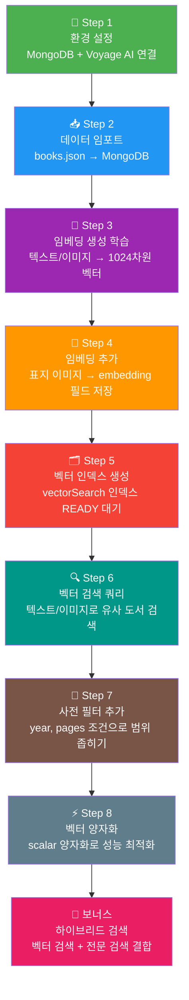
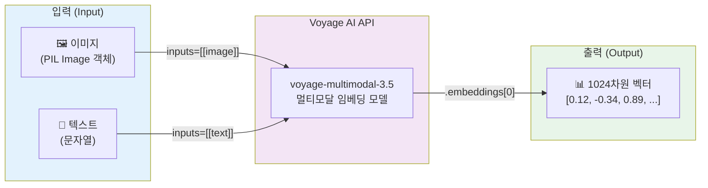
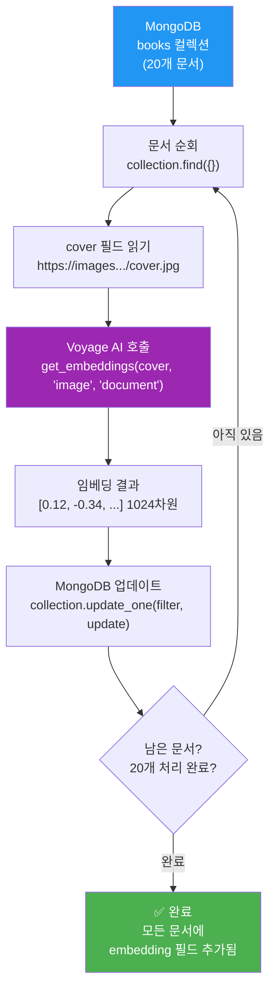
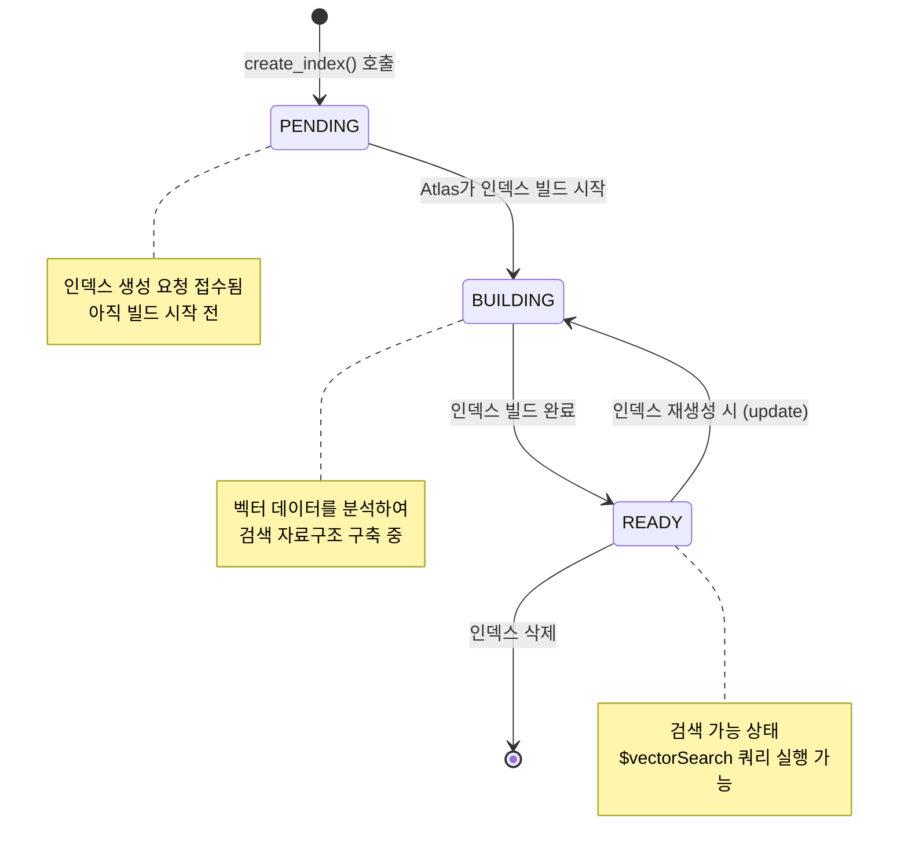
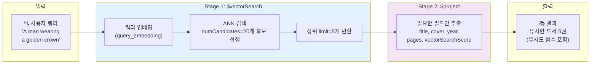
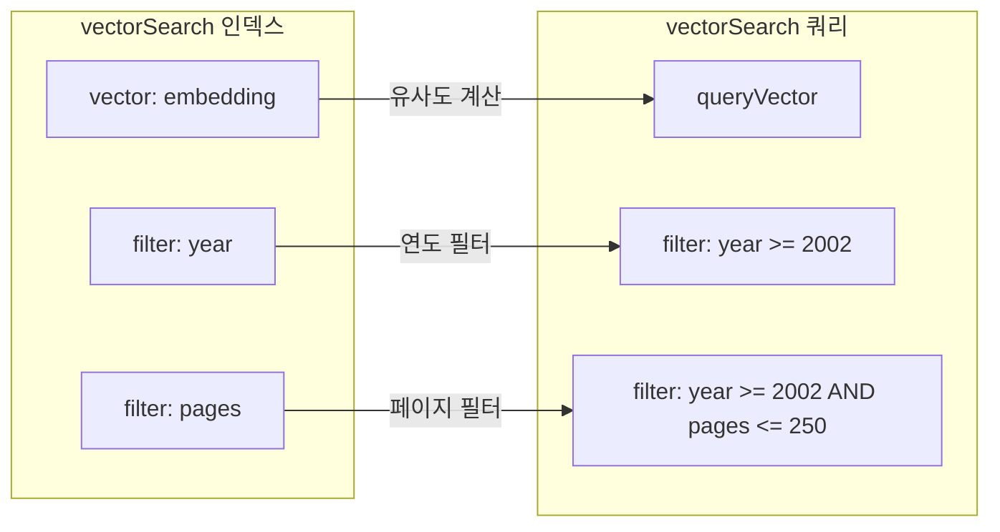
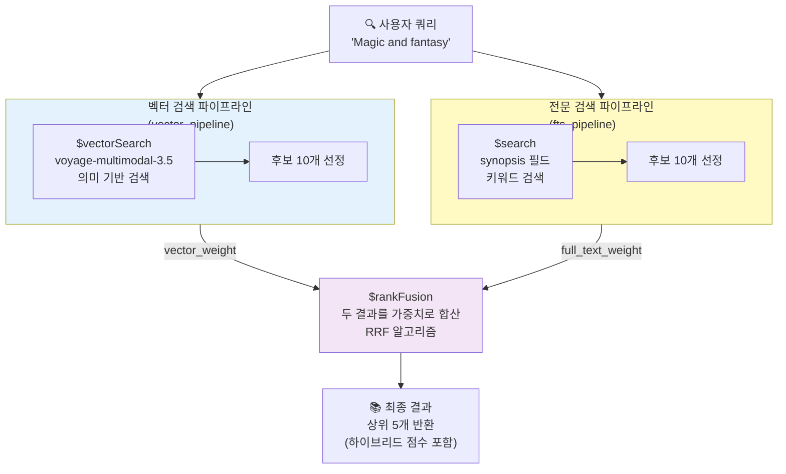
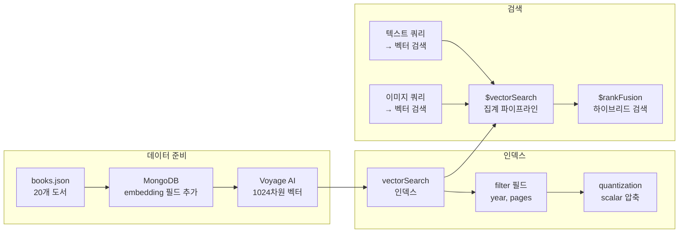

# 🔍 MongoDB 벡터 검색 완전 입문 가이드

> **대상 독자**: MongoDB와 벡터 검색을 처음 접하는 개발자
> **소요 시간**: 약 90분
> **난이도**: 초급 ~ 중급

---

## 📋 목차

1. [이 가이드에서 배울 것](#이-가이드에서-배울-것)
2. [핵심 개념 먼저 이해하기](#핵심-개념-먼저-이해하기)
3. [전체 워크플로우](#전체-워크플로우)
4. [Step 1: 환경 설정](#step-1-환경-설정)
5. [Step 2: 데이터 임포트](#step-2-데이터-임포트)
6. [Step 3: 임베딩 생성](#step-3-임베딩-생성)
7. [Step 4: 기존 데이터에 임베딩 추가](#step-4-기존-데이터에-임베딩-추가)
8. [Step 5: 벡터 검색 인덱스 생성](#step-5-벡터-검색-인덱스-생성)
9. [Step 6: 벡터 검색 쿼리 실행](#step-6-벡터-검색-쿼리-실행)
10. [Step 7: 사전 필터 추가](#step-7-사전-필터-추가)
11. [Step 8: 벡터 양자화](#step-8-벡터-양자화)
12. [보너스: 하이브리드 검색](#보너스-하이브리드-검색)
13. [전체 요약 및 다음 단계](#전체-요약-및-다음-단계)

---

## 이 가이드에서 배울 것

이 가이드를 마치면 다음을 할 수 있습니다.

- ✅ Voyage AI를 사용하여 텍스트와 이미지를 벡터(숫자 배열)로 변환하기
- ✅ MongoDB에 벡터 검색 인덱스 생성하기
- ✅ `$vectorSearch` 집계 파이프라인으로 의미 기반 검색 실행하기
- ✅ 필터 조건을 추가하여 검색 결과 범위 좁히기
- ✅ 벡터 양자화로 인덱스 성능 최적화하기
- ✅ 벡터 검색과 전문 검색을 결합한 하이브리드 검색 구현하기

**최종 결과물**: 도서 20권의 표지 이미지를 기반으로, 텍스트나 이미지로 유사한 책을 찾아주는 멀티모달 검색 시스템

---

## 핵심 개념 먼저 이해하기

### 벡터(Vector)란?

벡터는 숫자들의 배열입니다. 예를 들어 `[0.12, -0.34, 0.89, ...]` 같은 형태입니다.

AI 모델은 텍스트나 이미지의 **의미**를 이 숫자 배열로 표현합니다. 의미가 비슷한 것들은 숫자 배열도 비슷해집니다.

```
"강아지 사진" → [0.82, 0.15, -0.33, ...]
"귀여운 puppy" → [0.79, 0.18, -0.31, ...]  ← 의미가 비슷하므로 숫자도 비슷
"야구공"       → [-0.21, 0.94, 0.11, ...]  ← 의미가 달라서 숫자도 다름
```

### 벡터 검색이 왜 필요한가?

기존 키워드 검색의 한계:
- "강아지" 검색 시 "puppy", "개", "dog"는 찾지 못함
- 이미지로 유사한 이미지를 찾을 수 없음

벡터 검색의 강점:
- **의미** 기반 검색 — 단어가 달라도 의미가 같으면 찾아냄
- **멀티모달** — 텍스트로 이미지를, 이미지로 텍스트를 찾을 수 있음

### 임베딩(Embedding)이란?

임베딩은 AI 모델이 텍스트나 이미지를 벡터로 변환한 결과물입니다. 이 실습에서는 Voyage AI의 `voyage-multimodal-3.5` 모델을 사용하여 **1024차원** 벡터를 생성합니다.

---

## 전체 워크플로우



---

## Step 1: 환경 설정

### 무엇을 하는가?

MongoDB Atlas 클러스터에 연결하고, AI 임베딩 생성에 필요한 Voyage AI API 키를 설정합니다.

### 왜 하는가?

- **MongoDB 연결**: 도서 데이터를 저장하고 벡터 검색 인덱스를 생성할 데이터베이스에 접근하기 위해
- **Voyage AI API 키**: 텍스트와 이미지를 벡터로 변환해주는 AI 모델을 호출하기 위해

### 어떻게 동작하는가?

```python
import os
from pymongo import MongoClient

# 환경변수에서 MongoDB 연결 문자열 읽기
MONGODB_URI = os.getenv("MONGODB_URI")

# MongoDB 클라이언트 생성
mongodb_client = MongoClient(MONGODB_URI)

# 연결 확인 (ping)
mongodb_client.admin.command("ping")
# → {'ok': 1.0, ...}  ← ok: 1.0 이면 연결 성공!
```

```python
# 워크숍 강사가 제공한 패스키로 Voyage AI API 키 설정
PASSKEY = "b5/6KQ"
set_env(["voyageai"], PASSKEY)
# → Successfully set VOYAGE_API_KEY environment variable.
```

> 💡 **Tip**: `ping` 명령어는 MongoDB에 "잘 있어요?" 라고 물어보는 것입니다. `ok: 1.0`이 돌아오면 연결이 정상입니다.

---

## Step 2: 데이터 임포트

### 무엇을 하는가?

`books.json` 파일에 있는 도서 20권의 데이터를 MongoDB 컬렉션에 삽입합니다.

### 왜 하는가?

벡터 검색은 데이터베이스에 있는 문서에 대해 동작합니다. 먼저 검색 대상 데이터를 MongoDB에 저장해야 합니다.

### 데이터 구조

각 도서 문서는 다음 필드를 가집니다.

```json
{
  "_id": "0028608488",
  "title": "The Baseball Fan's Companion",
  "cover": "https://images.isbndb.com/covers/4318463482198.jpg",
  "genres": ["Baseball", "GV867 .B26 1996"],
  "pages": 272,
  "year": 1996,
  "synopsis": "For The Fan Who Just Needs To Brush Up..."
}
```

| 필드 | 설명 | 나중에 사용 |
|------|------|------------|
| `_id` | ISBN 번호 (고유 식별자) | - |
| `title` | 책 제목 | 검색 결과 표시 |
| `cover` | 표지 이미지 URL | **임베딩 생성 대상** |
| `genres` | 장르 목록 | - |
| `pages` | 페이지 수 | Step 7 필터 |
| `year` | 출판 연도 | Step 7 필터 |
| `synopsis` | 줄거리 | 하이브리드 검색 |

### 어떻게 동작하는가?

```python
# 데이터베이스와 컬렉션 이름 설정
DB_NAME = "mongodb_genai_devday_vs"
COLLECTION_NAME = "books"

# 컬렉션 객체 가져오기
collection = mongodb_client[DB_NAME][COLLECTION_NAME]

# JSON 파일 읽기
with open("../data/books.json", "r") as data_file:
    data = json.loads(data_file.read())

# 기존 문서 삭제 후 새로 삽입 (멱등성 보장)
collection.delete_many({})
collection.insert_many(data)

print(f"{collection.count_documents({})} documents ingested")
# → 20 documents ingested into the books collection.
```

> 💡 **멱등성이란?**: 같은 작업을 여러 번 실행해도 결과가 동일한 성질입니다. `delete_many({})` 후 삽입하면 중복 없이 항상 20개만 유지됩니다.

---

## Step 3: 임베딩 생성

### 무엇을 하는가?

Voyage AI의 `multimodal_embed` 메서드를 사용하여 이미지와 텍스트를 1024차원 벡터로 변환하는 방법을 배웁니다.

### 왜 하는가?

MongoDB의 벡터 검색은 숫자 배열(벡터) 끼리의 거리를 계산합니다. 따라서 이미지와 텍스트를 먼저 벡터로 변환해야 합니다.

### 임베딩 생성 과정



### 어떻게 동작하는가?

**이미지 임베딩:**

```python
import voyageai
from PIL import Image
import requests

# Voyage AI 클라이언트 초기화
vo = voyageai.Client()

# 이미지 URL에서 이미지 불러오기
image_url = "https://images.isbndb.com/covers/4318463482198.jpg"
image = Image.open(requests.get(image_url, stream=True).raw)

# 이미지를 벡터로 변환
embedding = vo.multimodal_embed(
    inputs=[[image]],           # 리스트의 리스트로 감쌈
    model="voyage-multimodal-3.5"
)

# 결과: 1024개의 숫자로 이루어진 배열
vector = embedding.embeddings[0]
# → [-0.024, 0.031, -0.018, 0.042, ...] (총 1024개)
```

**텍스트 임베딩:**

```python
text = "Puppy Preschool: Raising Your Puppy Right"

embedding = vo.multimodal_embed(
    inputs=[[text]],            # 텍스트도 동일한 메서드 사용
    model="voyage-multimodal-3.5"
)

vector = embedding.embeddings[0]
# → [0.018, -0.052, 0.033, ...] (총 1024개)
```

> 💡 **핵심 포인트**: 이미지와 텍스트 모두 **동일한 메서드**(`multimodal_embed`)와 **동일한 모델**(`voyage-multimodal-3.5`)을 사용합니다. 이렇게 하면 텍스트로 이미지를 검색하거나, 이미지로 텍스트를 검색하는 **크로스 모달 검색**이 가능합니다.

> ⚠️ **input_type 주의**: 이후 Step 4에서는 `input_type="document"` (저장할 데이터), Step 6에서는 `input_type="query"` (검색 쿼리)를 사용합니다. 같은 종류끼리 비교해야 정확한 결과를 얻습니다.

---

## Step 4: 기존 데이터에 임베딩 추가

### 무엇을 하는가?

MongoDB에 저장된 도서 20권 각각의 표지 이미지(`cover` 필드)를 임베딩하여 `embedding` 필드로 저장합니다.

### 왜 하는가?

벡터 검색 인덱스는 문서 안에 벡터 필드가 있어야 생성할 수 있습니다. 미리 임베딩을 계산하여 저장해두면 검색 시 매번 임베딩을 계산할 필요 없이 빠르게 비교가 가능합니다.

### 어떻게 동작하는가?



**임베딩 함수 정의:**

```python
def get_embeddings(content: str, mode: str, input_type: str) -> List[float]:
    """
    content: 임베딩할 내용 (이미지 URL 또는 텍스트)
    mode: "image" 또는 "text"
    input_type: "document" (저장용) 또는 "query" (검색용)
    """
    if mode == "image":
        # URL이면 다운로드, 파일 경로면 로컬에서 읽기
        if content.startswith("http"):
            content = Image.open(requests.get(content, stream=True).raw)
        else:
            content = Image.open(content)

    return vo.multimodal_embed(
        inputs=[[content]],
        model="voyage-multimodal-3.5",
        input_type=input_type    # ← 핵심! document vs query
    ).embeddings[0]
```

**컬렉션의 모든 문서에 임베딩 추가:**

```python
field_to_embed = "cover"      # 임베딩할 필드
embedding_field = "embedding"  # 저장할 필드명

for result in tqdm(collection.find({})):
    # 1. 표지 이미지 URL 가져오기
    content = result[field_to_embed]

    # 2. 이미지를 벡터로 변환 (저장용 → input_type="document")
    embedding = get_embeddings(content, "image", "document")

    # 3. MongoDB 문서 업데이트
    collection.update_one(
        {"_id": result["_id"]},           # 어떤 문서를? (필터)
        {"$set": {embedding_field: embedding}}  # 무엇을 업데이트? ($set)
    )
# → 20it [00:40, 2.04s/it]  (20개 처리, 약 40초 소요)
```

업데이트 후 문서 구조:

```json
{
  "_id": "0028608488",
  "title": "The Baseball Fan's Companion",
  "cover": "https://images.isbndb.com/covers/4318463482198.jpg",
  "pages": 272,
  "year": 1996,
  "synopsis": "...",
  "embedding": [-0.024, 0.031, -0.018, 0.042, "...총 1024개..."]
}
```

> 💡 **`$set` 연산자**: MongoDB에서 문서의 특정 필드만 업데이트할 때 사용합니다. 다른 필드는 그대로 유지됩니다. `$set` 없이 업데이트하면 문서 전체가 교체되어 버립니다.

---

## Step 5: 벡터 검색 인덱스 생성

### 무엇을 하는가?

MongoDB Atlas에 `vectorSearch` 타입의 검색 인덱스를 생성합니다. 이 인덱스가 있어야 `$vectorSearch` 연산자로 빠른 벡터 유사도 검색이 가능합니다.

### 왜 하는가?

인덱스 없이 벡터 검색을 하려면 모든 문서의 벡터와 하나씩 비교해야 합니다(O(n) 선형 탐색). 인덱스가 있으면 ANN(Approximate Nearest Neighbor) 알고리즘으로 훨씬 빠르게 근사 이웃을 찾을 수 있습니다.

### 인덱스 상태 흐름



### 어떻게 동작하는가?

**인덱스 정의:**

```python
ATLAS_VECTOR_SEARCH_INDEX_NAME = "vector_index"

model = {
    "name": ATLAS_VECTOR_SEARCH_INDEX_NAME,  # 인덱스 이름
    "type": "vectorSearch",                  # 인덱스 타입
    "definition": {
        "fields": [
            {
                "type": "vector",       # 벡터 필드임을 명시
                "path": "embedding",    # 문서에서 벡터가 저장된 필드명
                "numDimensions": 1024,  # 벡터 차원 수 (모델과 일치해야 함)
                "similarity": "cosine", # 유사도 측정 방식
            }
        ]
    },
}
```

**유사도 측정 방식 비교:**

| 방식 | 설명 | 적합한 경우 |
|------|------|-----------|
| `cosine` | 벡터 방향의 유사도 (크기 무관) | **텍스트/이미지 임베딩** (권장) |
| `euclidean` | 두 벡터 간의 직선 거리 | 좌표 기반 데이터 |
| `dotProduct` | 내적 (크기 + 방향 모두 고려) | 정규화된 벡터 |

**인덱스 생성 및 상태 확인:**

```python
# 인덱스 생성 (비동기 — 바로 READY가 되지 않음)
create_index(collection, ATLAS_VECTOR_SEARCH_INDEX_NAME, model)

# READY 상태가 될 때까지 폴링 (최대 수십 초 대기)
check_index_ready(collection, ATLAS_VECTOR_SEARCH_INDEX_NAME)
# → Polling index "vector_index" ... READY ✓
```

> ⚠️ **중요**: `create_index()`는 **비동기**로 동작합니다. 함수가 반환되어도 인덱스가 아직 빌드 중일 수 있습니다. `check_index_ready()`로 반드시 READY 상태를 확인한 후 검색을 실행해야 합니다.

> 💡 **인덱스 조회**: `list(collection.list_search_indexes())`로 생성된 벡터 검색 인덱스 목록을 확인할 수 있습니다. 일반 B-Tree 인덱스(`collection.index_information()`)와는 별도로 관리됩니다.

---

## Step 6: 벡터 검색 쿼리 실행

### 무엇을 하는가?

`$vectorSearch` 집계 파이프라인을 사용하여 텍스트 또는 이미지 쿼리와 가장 유사한 도서를 검색합니다.

### 왜 하는가?

인덱스가 준비되었으니 실제 검색을 수행할 차례입니다. MongoDB의 집계 파이프라인은 데이터가 여러 처리 단계를 순서대로 통과하는 방식으로 동작합니다.

### 벡터 검색 파이프라인 구조



### 어떻게 동작하는가?

```python
def vector_search(user_query: str, mode: str, filter: dict = {}) -> None:
    # 1. 쿼리를 벡터로 변환 (검색용 → input_type="query")
    query_embedding = get_embeddings(user_query, mode, "query")

    # 2. 집계 파이프라인 정의
    pipeline = [
        # Stage 1: 벡터 유사도 검색
        {
            "$vectorSearch": {
                "index": ATLAS_VECTOR_SEARCH_INDEX_NAME,  # 사용할 인덱스
                "queryVector": query_embedding,            # 검색 기준 벡터
                "path": "embedding",                       # 비교할 문서 필드
                "numCandidates": 20,  # 후보 수 (많을수록 정확, 느림)
                "filter": filter,     # 사전 필터 (Step 7에서 사용)
                "limit": 5,           # 최종 반환 수
            }
        },
        # Stage 2: 필요한 필드만 추출
        {
            "$project": {
                "_id": 0,            # 0: 제외
                "title": 1,          # 1: 포함
                "cover": 1,
                "year": 1,
                "pages": 1,
                "score": {"$meta": "vectorSearchScore"},  # 유사도 점수
            }
        },
    ]

    # 3. 파이프라인 실행
    results = collection.aggregate(pipeline)
```

**텍스트 쿼리로 검색:**

```python
# 황금 왕관을 쓴 남자 → 관련 도서 검색
vector_search("A man wearing a golden crown", "text")

# 더 시도해볼 쿼리들:
vector_search("A rainbow of lively colors", "text")
vector_search("Creatures wondrous or familiar", "text")
vector_search("A boy and the ocean", "text")
vector_search("Houses", "text")
```

**이미지 쿼리로 검색:**

```python
# 이미지 URL로 유사한 표지 검색
vector_search("https://images.isbndb.com/covers/10835953482746.jpg", "image")

# 로컬 이미지로도 가능
vector_search("../data/images/salad.jpg", "image")
vector_search("../data/images/kitten.png", "image")
vector_search("../data/images/barn.png", "image")
```

> 💡 **numCandidates vs limit**: `numCandidates`는 ANN 알고리즘이 먼저 뽑는 후보 수입니다. 후보가 많을수록 정확도는 높아지지만 속도는 느려집니다. 일반적으로 `limit`의 10~20배를 권장합니다.

> 💡 **`$meta: "vectorSearchScore"`**: MongoDB의 특수 문법으로, 벡터 검색이 계산한 유사도 점수를 추출합니다. cosine 유사도는 0~1 사이 값으로, 1에 가까울수록 더 유사합니다.

---

## Step 7: 사전 필터 추가

### 무엇을 하는가?

벡터 검색 인덱스에 필터 타입 필드를 추가하여, 메타데이터 조건(출판 연도, 페이지 수 등)을 함께 적용할 수 있게 합니다.

### 왜 하는가?

순수 벡터 검색은 의미적 유사도만 고려합니다. 하지만 실제 서비스에서는 "2002년 이후 출판된 책 중에서" 또는 "250페이지 이하인 책 중에서" 처럼 조건을 함께 사용해야 할 때가 많습니다.

> ⚠️ **중요**: 벡터 검색의 `filter`는 일반 MongoDB 쿼리 필터와 다릅니다. 반드시 **인덱스에 `filter` 타입으로 등록된 필드**만 사용할 수 있습니다.

### 필터 필드가 있는 인덱스 구조



### 어떻게 동작하는가?

**인덱스에 filter 필드 추가 (year만):**

```python
model = {
    "name": ATLAS_VECTOR_SEARCH_INDEX_NAME,
    "type": "vectorSearch",
    "definition": {
        "fields": [
            {
                "type": "vector",
                "path": "embedding",
                "numDimensions": 1024,
                "similarity": "cosine",
            },
            # ← 새로 추가된 filter 필드
            {"type": "filter", "path": "year"},
        ]
    },
}
create_index(collection, ATLAS_VECTOR_SEARCH_INDEX_NAME, model)
check_index_ready(collection, ATLAS_VECTOR_SEARCH_INDEX_NAME)
```

**단일 조건 필터 (2002년 이후):**

```python
# $gte: greater than or equal to (이상)
filter = {"year": {"$gte": 2002}}

vector_search("A boy and the ocean", "text", filter)
# → 2002년 이후 출판된 책 중에서 "바다 소년" 관련 도서 5권 반환
```

**인덱스에 filter 필드 추가 (year + pages):**

```python
model = {
    "name": ATLAS_VECTOR_SEARCH_INDEX_NAME,
    "type": "vectorSearch",
    "definition": {
        "fields": [
            {"type": "vector", "path": "embedding",
             "numDimensions": 1024, "similarity": "cosine"},
            {"type": "filter", "path": "year"},
            {"type": "filter", "path": "pages"},  # ← pages 추가
        ]
    },
}
create_index(collection, ATLAS_VECTOR_SEARCH_INDEX_NAME, model)
check_index_ready(collection, ATLAS_VECTOR_SEARCH_INDEX_NAME)
```

**복합 조건 필터 (2002년 이후 AND 250페이지 이하):**

```python
# $and: 두 조건 모두 만족
# $gte: 이상 (greater than or equal)
# $lte: 이하 (less than or equal)
filter = {
    "$and": [
        {"year": {"$gte": 2002}},
        {"pages": {"$lte": 250}}
    ]
}

vector_search("A boy and the ocean", "text", filter)
# → 2002년 이후 출판 AND 250페이지 이하 책 중에서 검색
```

**MongoDB 비교 연산자 정리:**

| 연산자 | 의미 | 설명 |
|--------|------|------|
| `$gte` | 이상 (≥) | year >= 2002 |
| `$lte` | 이하 (≤) | pages <= 250 |
| `$gt` | 초과 (>) | year > 2000 |
| `$lt` | 미만 (<) | pages < 300 |
| `$eq` | 같음 (=) | year == 2005 |
| `$and` | 논리 AND | 두 조건 모두 만족 |
| `$or` | 논리 OR | 조건 중 하나 이상 만족 |

---

## Step 8: 벡터 양자화

### 무엇을 하는가?

벡터 검색 인덱스에 **scalar 양자화**를 적용하여 인덱스 크기를 줄이고 검색 속도를 높입니다.

### 왜 하는가?

1024차원 벡터는 각 숫자가 32비트(4바이트) 부동소수점으로 저장됩니다. 문서가 많아지면 인덱스 크기와 메모리 사용량이 커집니다.

Scalar 양자화는 각 숫자를 32비트 → 8비트로 압축합니다.

| 항목 | 원본 | Scalar 양자화 후 |
|------|------|-----------------|
| 숫자당 크기 | 32비트 (4바이트) | 8비트 (1바이트) |
| 압축률 | 기준 | 약 4배 감소 |
| 정확도 | 100% | 약간 감소 (미미) |
| 검색 속도 | 기준 | 더 빠름 |

### 어떻게 동작하는가?

```python
model = {
    "name": ATLAS_VECTOR_SEARCH_INDEX_NAME,
    "type": "vectorSearch",
    "definition": {
        "fields": [
            {
                "type": "vector",
                "path": "embedding",
                "numDimensions": 1024,
                "similarity": "cosine",
                "quantization": "scalar",  # ← 이 한 줄 추가!
            },
        ]
    },
}

create_index(collection, ATLAS_VECTOR_SEARCH_INDEX_NAME, model)
check_index_ready(collection, ATLAS_VECTOR_SEARCH_INDEX_NAME)
```

> 💡 **언제 양자화를 사용하나?**: 문서 수가 수천 개 이상이거나, 메모리 비용이 문제가 될 때 사용합니다. 이 실습처럼 20개 문서라면 효과가 미미하지만, 실제 프로덕션 환경에서는 큰 차이를 만듭니다.

> 💡 **다른 양자화 옵션**: MongoDB Atlas는 `"scalar"` 외에도 `"binary"` 양자화도 지원합니다. Binary는 더 공격적으로 압축하지만 정확도 손실이 더 큽니다.

---

## 보너스: 하이브리드 검색

### 무엇을 하는가?

`$rankFusion` 연산자를 사용하여 벡터 검색(의미 기반)과 전문 검색(Full-Text Search, 키워드 기반)의 결과를 결합합니다.

### 왜 하는가?

각 검색 방식에는 강점과 약점이 있습니다.

| 구분 | 벡터 검색 | 전문 검색 |
|------|-----------|-----------|
| 강점 | 의미가 같으면 단어가 달라도 찾음 | 정확한 키워드 매칭 |
| 약점 | 정확한 고유명사/용어 검색에 약함 | 동의어, 의미 기반 검색 불가 |

하이브리드 검색은 두 방식의 결과를 **가중치**를 주어 합산하여 약점을 보완합니다.

### 하이브리드 검색 구조



### 필요한 인덱스 2개

하이브리드 검색은 두 개의 인덱스가 필요합니다.

```
1. vector_index  (vectorSearch 타입) - 벡터 유사도 검색용
2. fts_index     (search 타입)       - 전문 키워드 검색용
```

**전문 검색 인덱스 생성:**

```python
ATLAS_FTS_INDEX_NAME = "fts_index"

# synopsis 필드에 대한 전문 검색 인덱스
model = {
    "name": ATLAS_FTS_INDEX_NAME,
    "type": "search",  # ← vectorSearch가 아닌 search 타입
    "definition": {
        "mappings": {
            "dynamic": False,
            "fields": {
                "synopsis": {"type": "string"}  # synopsis 필드를 문자열로 인덱싱
            }
        }
    },
}

create_index(collection, ATLAS_FTS_INDEX_NAME, model)
```

### 어떻게 동작하는가?

```python
def hybrid_search(user_query: str, vector_weight: float, full_text_weight: float):
    pipeline = [
        {
            "$rankFusion": {
                "input": {
                    "pipelines": {
                        # 파이프라인 1: 벡터 검색
                        "vector_pipeline": [
                            {
                                "$vectorSearch": {
                                    "index": ATLAS_VECTOR_SEARCH_INDEX_NAME,
                                    "path": "embedding",
                                    "queryVector": get_embeddings(user_query, "text", "query"),
                                    "numCandidates": 20,
                                    "limit": 10,
                                }
                            }
                        ],
                        # 파이프라인 2: 전문 검색
                        "fts_pipeline": [
                            {
                                "$search": {
                                    "index": ATLAS_FTS_INDEX_NAME,
                                    "text": {
                                        "query": user_query,
                                        "path": "synopsis",  # synopsis 필드에서 검색
                                    },
                                }
                            },
                            {"$limit": 10},
                        ],
                    }
                },
                # 가중치 설정: 두 파이프라인 결과 합산 비율
                "combination": {
                    "weights": {
                        "vector_pipeline": vector_weight,
                        "fts_pipeline": full_text_weight
                    }
                },
                "scoreDetails": True,
            }
        },
        # 결과 필드 선택
        {
            "$project": {
                "_id": 0, "title": 1, "cover": 1,
                "score": {"$getField": {"field": "value", "input": {"$meta": "scoreDetails"}}},
            }
        },
        {"$limit": 5},
    ]

    return collection.aggregate(pipeline)
```

**가중치 실험:**

```python
# 실험 1: 벡터 검색만 사용 (순수 의미 검색)
hybrid_search("Magic and fantasy", vector_weight=1.0, full_text_weight=0.0)

# 실험 2: 전문 검색 비중을 높임 (키워드 "Magic", "fantasy" 중요)
hybrid_search("Magic and fantasy", vector_weight=0.3, full_text_weight=0.7)
```

**가중치 조합 가이드:**

| 상황 | vector_weight | full_text_weight |
|------|---------------|------------------|
| 이미지/감성 검색 위주 | 1.0 | 0.0 |
| 균형 잡힌 검색 | 0.5 | 0.5 |
| 키워드 정확도 중요 | 0.3 | 0.7 |
| 전문 용어/고유명사 | 0.0 | 1.0 |

> 💡 **RRF (Reciprocal Rank Fusion)**: `$rankFusion`이 내부적으로 사용하는 알고리즘입니다. 각 파이프라인에서의 순위(rank)를 역수로 변환하여 합산합니다. 순위가 높을수록 점수가 높아집니다.

---

## 전체 요약 및 다음 단계

### 이 실습에서 배운 것



### 핵심 개념 정리

| 개념 | 설명 | 관련 Step |
|------|------|-----------|
| 임베딩 | 텍스트/이미지 → 숫자 배열 | Step 3 |
| `input_type` | document(저장) vs query(검색) 구분 | Step 4, 6 |
| vectorSearch 인덱스 | ANN 검색을 위한 특수 인덱스 | Step 5 |
| `$vectorSearch` | 집계 파이프라인의 벡터 검색 단계 | Step 6 |
| filter 타입 필드 | 메타데이터 조건 필터링 | Step 7 |
| scalar 양자화 | 벡터를 4배 압축하여 성능 향상 | Step 8 |
| `$rankFusion` | 벡터 + 전문 검색 결합 | 보너스 |

### 다음으로 학습할 내용

- **RAG (Retrieval Augmented Generation)**: 벡터 검색으로 찾은 문서를 LLM에게 컨텍스트로 제공하여 답변 품질 향상 → `ai-rag-lab.ipynb`
- **AI Agents**: 도구(Tool)를 사용하는 AI 에이전트 구현 → `ai-agents-lab.ipynb`
- **MongoDB Atlas Vector Search 공식 문서**: https://www.mongodb.com/docs/atlas/atlas-vector-search/
- **Voyage AI 공식 문서**: https://docs.voyageai.com/docs/multimodal-embeddings

---

> 📌 **이 가이드에서 다룬 노트북**: `/solutions/vector-search-lab.ipynb`
> 📌 **실습 노트북**: `/labs/vector-search-lab.ipynb`
> 📌 **데이터**: `/data/books.json`
